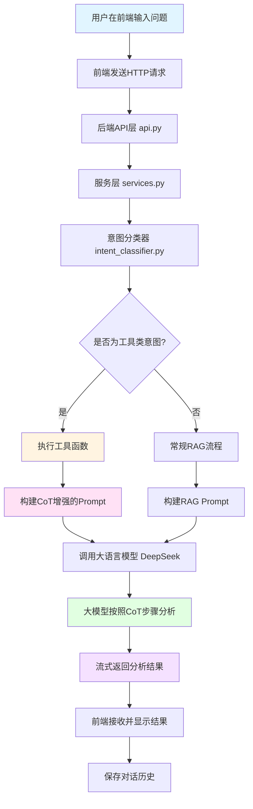
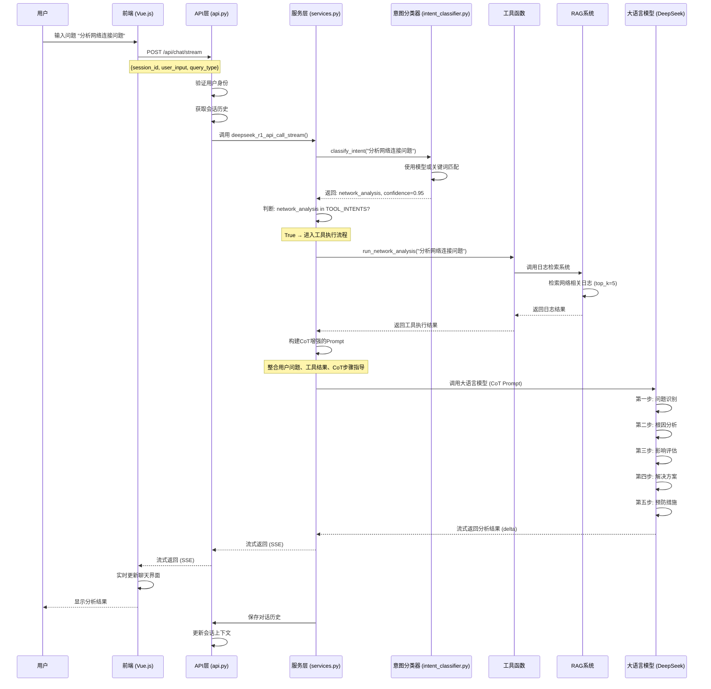
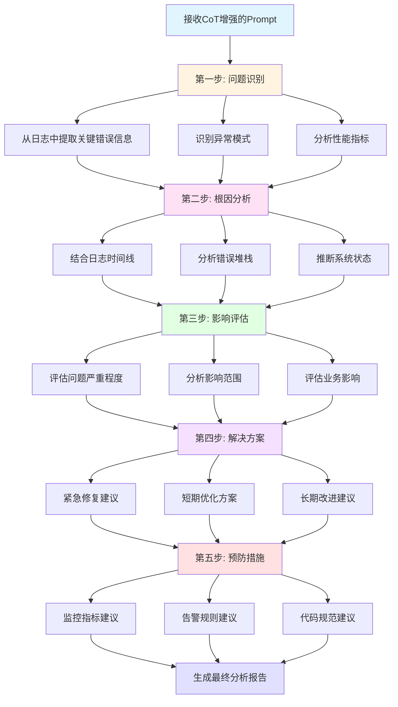
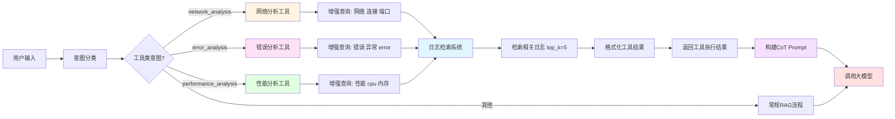
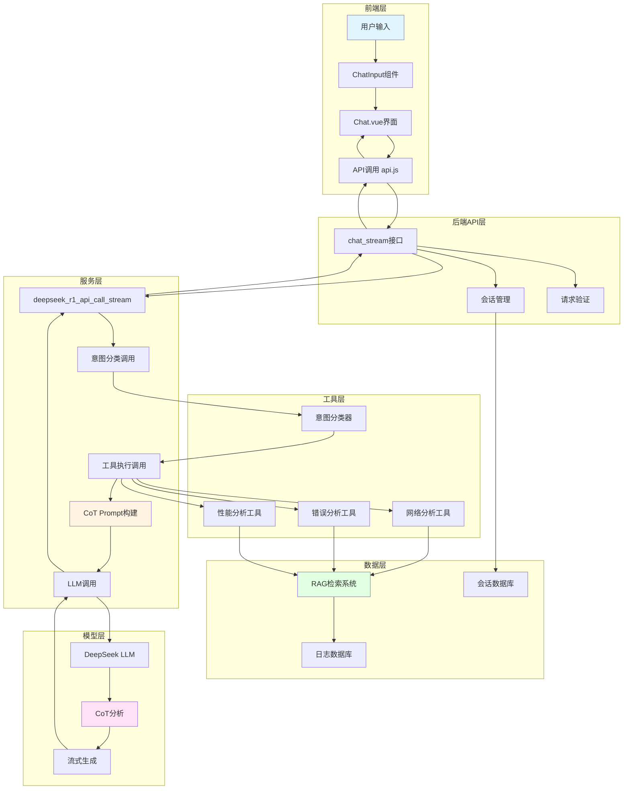

# 分析功能与CoT思维链实现详解

## 一、概述

本文档详细介绍了系统中分析功能的实现，特别是如何通过**函数定义**和**思维链（Chain of Thought, CoT）**来引导大模型使用新工具，实现智能分析功能。

### 1.1 核心概念

#### 分析功能
分析功能是指系统能够识别用户的分析意图，调用相应的工具函数获取数据，然后使用大模型对数据进行深度分析和解释。

#### 思维链（CoT）
思维链是一种提示工程技术，通过引导大模型按照步骤思考，提高推理和分析的准确性。在本系统中，CoT用于：
- 引导大模型理解工具执行结果
- 按照结构化步骤进行分析
- 生成专业、准确的分析报告

#### 工具调用
系统定义了三个分析工具：
- **网络分析工具**（`network_analysis`）：分析网络连接问题
- **错误分析工具**（`error_analysis`）：分析系统错误和异常
- **性能分析工具**（`performance_analysis`）：分析系统性能瓶颈

---

## 二、系统架构

### 2.1 整体架构图

```
┌─────────────┐
│   前端界面   │ (Vue.js)
│  Chat.vue   │
└──────┬──────┘
       │ HTTP POST /api/chat/stream
       │ {session_id, user_input, query_type}
       ▼
┌─────────────────────────────────────────┐
│         后端API层 (Django)              │
│  ┌───────────────────────────────────┐  │
│  │  api.py                           │  │
│  │  - chat_stream()                  │  │
│  │  - 处理请求、会话管理              │  │
│  └───────────┬───────────────────────┘  │
│              │                           │
│              ▼                           │
│  ┌───────────────────────────────────┐  │
│  │  services.py                      │  │
│  │  - deepseek_r1_api_call_stream()  │  │
│  │  - 工具调用、LLM调用               │  │
│  └───────────┬───────────────────────┘  │
│              │                           │
│              ▼                           │
│  ┌───────────────────────────────────┐  │
│  │  intent_classifier.py             │  │
│  │  - 意图分类                        │  │
│  │  - 工具执行函数                    │  │
│  └───────────┬───────────────────────┘  │
│              │                           │
│              ▼                           │
│  ┌───────────────────────────────────┐  │
│  │  topklogsystem.py                 │  │
│  │  - RAG检索系统                     │  │
│  │  - 日志检索和分析                  │  │
│  └───────────────────────────────────┘  │
└─────────────────────────────────────────┘
              │
              ▼
┌─────────────────────────────────────────┐
│         大语言模型 (DeepSeek)            │
│  - 工具结果分析                          │
│  - CoT思维链引导                         │
│  - 生成专业分析报告                      │
└─────────────────────────────────────────┘
```

### 2.2 核心组件

1. **意图分类器**（`intent_classifier.py`）
   - 识别用户意图类型
   - 判断是否需要调用工具
   - 执行工具函数

2. **服务层**（`services.py`）
   - 协调工具调用和LLM调用
   - 构建CoT增强的Prompt
   - 流式返回结果

3. **工具函数**（`intent_classifier.py`中的工具方法）
   - `run_network_analysis()`：网络分析工具
   - `run_error_analysis()`：错误分析工具
   - `run_performance_analysis()`：性能分析工具

4. **Prompt模板**（`prompt_templates.py`）
   - 定义CoT思维链结构
   - 提供分析步骤指导

---

## 三、CoT思维链设计

### 3.1 CoT Prompt结构

系统使用结构化的CoT Prompt来引导大模型进行分析：

```python
enhanced_prompt = f"""用户问题：{prompt}

工具执行结果：
{tool_result}

请基于以上工具执行结果，对用户的问题进行详细分析和回答。要求：
1. 对工具结果进行总结和分析
2. 指出关键问题和异常
3. 提供具体的建议和解决方案
4. 用清晰、专业的方式组织回答"""
```

### 3.2 详细的CoT步骤

对于日志分析场景，系统定义了更详细的CoT步骤（在`prompt_templates.py`中）：

```python
LOG_ANALYSIS_TEMPLATE = """## 相关历史日志
{log_context}

## 分析任务
{query}

## 分析要求
请按照以下步骤进行分析：

### 第一步：问题识别
从日志中提取关键错误信息、异常模式、性能指标

### 第二步：根因分析
结合日志时间线、错误堆栈、系统状态，推断问题根本原因

### 第三步：影响评估
评估问题的严重程度、影响范围、业务影响

### 第四步：解决方案
提供分层解决方案：
- 紧急修复（立即可执行）
- 短期优化（一周内）
- 长期改进（架构层面）

### 第五步：预防措施
建议监控指标、告警规则、代码规范
"""
```

### 3.3 CoT的优势

1. **结构化思考**：引导大模型按照步骤思考，避免遗漏关键信息
2. **提高准确性**：逐步分析有助于提高分析的准确性
3. **可解释性**：清晰的步骤使得分析过程可追溯
4. **专业性**：结构化的输出更符合专业分析报告的要求

---

## 四、前后端代码实现详解

### 4.1 后端代码实现

#### 4.1.1 意图分类器（`intent_classifier.py`）

**核心功能**：识别用户意图，判断是否需要调用工具

```python
class LightweightIntentClassifier:
    """轻量级意图分类器 - 支持 Ollama 和 DeepSeek API"""
    
    def __init__(self, ...):
        # 定义工具类意图类型
        self.tools = {
            IntentType.NETWORK_ANALYSIS: self.run_network_analysis,
            IntentType.ERROR_ANALYSIS: self.run_error_analysis,
            IntentType.PERFORMANCE_ANALYSIS: self.run_performance_analysis,
        }
    
    def classify_intent(self, text: str) -> IntentResult:
        """
        分类用户意图
        
        流程：
        1. 使用模型或关键词匹配识别意图
        2. 返回意图类型和置信度
        3. 判断是否为工具类意图
        """
        # 使用模型进行意图分类
        intent, confidence = self._classify_with_model(text)
        
        return IntentResult(
            intent=intent,
            confidence=confidence,
            processing_time=processing_time,
            model_used=self.model_name
        )
```

**工具执行函数**：

```python
def run_network_analysis(self, query: str) -> str:
    """
    网络分析工具
    
    功能：
    1. 调用日志检索系统
    2. 使用增强查询关键词检索网络相关日志
    3. 返回格式化的工具执行结果
    """
    logger.info(f"🔧 [工具执行] 网络分析工具 - 查询: {query}")
    try:
        from .services import get_log_system
        system = get_log_system()
        # 添加网络相关关键词增强查询
        enhanced_query = f"网络 连接 端口 {query}"
        log_results = system.retrieve_logs(enhanced_query, top_k=5)
        
        if log_results:
            result_parts = ["📡 网络分析结果：\n"]
            result_parts.append(f"检索到 {len(log_results)} 条相关日志：\n")
            for i, log in enumerate(log_results, 1):
                content = log.get('content', '')
                if len(content) > 500:
                    content = content[:500] + "..."
                result_parts.append(f"{i}. {content}")
            return "\n".join(result_parts)
        else:
            return "📡 网络分析结果：未发现明显的网络连接问题。"
    except Exception as e:
        logger.error(f"网络分析工具执行失败: {e}")
        return f"📡 网络分析结果：工具执行异常: {str(e)}"
```

#### 4.1.2 服务层（`services.py`）

**核心功能**：协调工具调用和LLM调用，构建CoT增强的Prompt

```python
def deepseek_r1_api_call_stream(prompt: str, query_type: str = "analysis", history_context: str = ""):
    """
    流式调用 DeepSeek API（支持工具调用和CoT思维链）
    
    流程：
    1. 意图分类：识别用户意图
    2. 工具执行：如果是工具类意图，执行工具函数
    3. CoT Prompt构建：将工具结果整合到CoT Prompt中
    4. LLM调用：使用CoT Prompt调用大模型
    5. 流式返回：逐步返回分析结果
    """
    # 1. 意图分类
    from .intent_classifier import get_intent_classifier, TOOL_INTENTS
    classifier = get_intent_classifier()
    intent_result = classifier.classify_intent(prompt)
    
    print(f"🔍 [意图分类] 意图: {intent_result.intent.value}, 置信度: {intent_result.confidence:.3f}")
    
    # 2. 工具执行
    tool_result = None
    if intent_result.intent in TOOL_INTENTS:
        print(f"🔧 [工具调用] 检测到工具类意图: {intent_result.intent.value}")
        tool_func = classifier.tools.get(intent_result.intent)
        if tool_func:
            tool_result = tool_func(prompt)
            print(f"✅ [工具执行] 工具执行完成，结果长度: {len(tool_result)} 字符")
    
    # 3. CoT Prompt构建
    if tool_result:
        # 构建包含工具结果和CoT指导的Prompt
        enhanced_prompt = f"""用户问题：{prompt}

工具执行结果：
{tool_result}

请基于以上工具执行结果，对用户的问题进行详细分析和回答。要求：
1. 对工具结果进行总结和分析
2. 指出关键问题和异常
3. 提供具体的建议和解决方案
4. 用清晰、专业的方式组织回答"""
        
        print(f"🤖 [工具增强Prompt] 构建完成，长度: {len(enhanced_prompt)} 字符")
        messages.append(ChatMessage(role="user", content=enhanced_prompt))
        
        # 4. LLM调用
        llm = DeepSeekLLM(model=CURRENT_CONFIG['llm'], timeout=120)
        print(f"🤖 [流式生成] 开始基于工具结果流式生成回复...")
        return llm.stream_chat(messages)
    
    # 5. 如果不是工具类意图，使用常规RAG流程
    # ... (RAG检索和LLM调用)
```

#### 4.1.3 API接口（`api.py`）

**核心功能**：处理HTTP请求，调用服务层函数

```python
@router.post("/chat/stream")
def chat_stream(request, data: ChatIn):
    """
    流式聊天接口
    
    流程：
    1. 验证用户身份
    2. 获取会话历史
    3. 调用服务层函数进行工具调用和LLM调用
    4. 流式返回结果
    5. 保存对话历史
    """
    # 1. 认证验证
    if not request.auth:
        return StreamingHttpResponse(...)
    
    # 2. 获取会话
    user = request.auth
    session = get_or_create_session(session_id, user)
    
    def stream_generator():
        """生成器函数：流式返回"""
        try:
            # 3. 调用服务层函数
            from .services import deepseek_r1_api_call_stream
            
            stream_response = deepseek_r1_api_call_stream(
                user_input, 
                query_type, 
                history_context=session.context
            )
            
            # 4. 流式返回结果
            full_reply = ""
            for response in stream_response:
                delta = response.delta if hasattr(response, 'delta') else ""
                if delta:
                    full_reply += delta
                    yield f"data: {json.dumps({'delta': delta, 'content': full_reply})}\n\n"
            
            # 5. 保存对话历史
            # ... (保存逻辑)
            
            yield f"data: {json.dumps({'done': True, 'content': full_reply})}\n\n"
        except Exception as e:
            yield f"data: {json.dumps({'error': str(e)})}\n\n"
    
    return StreamingHttpResponse(stream_generator(), content_type='text/event-stream')
```

### 4.2 前端代码实现

#### 4.2.1 API调用（`api.js`）

**核心功能**：调用后端API，处理流式响应

```javascript
async chatStream(sessionId, userInput, queryType = "general_chat", signal, onMessage, onError, onComplete) {
  const token = localStorage.getItem('apiKey');
  const baseURL = window.location.origin;
  
  try {
    // 1. 发送HTTP POST请求
    const response = await fetch(`${baseURL}/api/chat/stream`, {
      method: 'POST',
      headers: {
        'Content-Type': 'application/json',
        'Authorization': `Bearer ${token}`,
      },
      body: JSON.stringify({
        session_id: sessionId,
        user_input: userInput,
        query_type: queryType,  // "analysis" 或 "general_chat"
      }),
      signal: signal,
    });

    // 2. 处理流式响应
    const reader = response.body.getReader();
    const decoder = new TextDecoder();
    let buffer = '';

    while (true) {
      const { done, value } = await reader.read();
      if (done) break;

      buffer += decoder.decode(value, { stream: true });
      const lines = buffer.split('\n\n');
      buffer = lines.pop();

      for (const line of lines) {
        if (line.startsWith('data: ')) {
          const data = JSON.parse(line.slice(6));
          
          // 3. 处理增量内容
          if (data.delta) {
            onMessage(data.delta, data.content);
          }
          
          // 4. 处理完成信号
          if (data.done) {
            onComplete(data.content);
          }
          
          // 5. 处理错误
          if (data.error) {
            onError(data.error);
          }
        }
      }
    }
  } catch (error) {
    onError(error.message);
  }
}
```

#### 4.2.2 聊天界面（`Chat.vue`）

**核心功能**：用户界面，处理用户输入和显示回复

```vue
<template>
  <div class="chat-container">
    <!-- 聊天消息列表 -->
    <div class="messages-container">
      <ChatMessage
        v-for="msg in messages"
        :key="msg.id"
        :is-user="msg.isUser"
        :content="msg.content"
        :timestamp="msg.timestamp"
      />
    </div>

    <!-- 聊天输入框 -->
    <ChatInput 
      :loading="loading" 
      @send="handleSendMessage" 
      @stop="handleStopGeneration" 
    />
  </div>
</template>

<script>
export default {
  methods: {
    async handleSendMessage(message, queryType = 'analysis') {
      // 1. 添加用户消息到界面
      this.addMessage(message, true);
      
      // 2. 设置加载状态
      this.loading = true;
      this.currentReply = '';
      
      // 3. 调用API进行流式聊天
      await api.chatStream(
        this.currentSession,
        message,
        queryType,
        this.abortController.signal,
        // 4. 处理增量消息
        (delta, fullContent) => {
          this.currentReply = fullContent;
          this.updateLastMessage(fullContent);
        },
        // 5. 处理错误
        (error) => {
          console.error('Chat error:', error);
          this.loading = false;
        },
        // 6. 处理完成
        (fullContent) => {
          this.loading = false;
          this.addMessage(fullContent, false);
        }
      );
    }
  }
}
</script>
```

#### 4.2.3 聊天输入组件（`ChatInput.vue`）

**核心功能**：处理用户输入，支持选择查询类型

```vue
<template>
  <div class="chat-input-container">
    <!-- 查询类型选择 -->
    <div class="query-type-selector">
      <button 
        :class="{ active: queryType === 'analysis' }"
        @click="queryType = 'analysis'"
      >
        日志分析
      </button>
      <button 
        :class="{ active: queryType === 'general_chat' }"
        @click="queryType = 'general_chat'"
      >
        日常聊天
      </button>
    </div>

    <!-- 输入框 -->
    <textarea
      v-model="inputText"
      @keydown.enter.prevent="handleSend"
      placeholder="输入您的问题..."
    ></textarea>

    <!-- 发送按钮 -->
    <button @click="handleSend" :disabled="loading">
      发送
    </button>
  </div>
</template>

<script>
export default {
  data() {
    return {
      inputText: '',
      queryType: 'analysis',  // 默认使用日志分析模式
    };
  },
  methods: {
    handleSend() {
      if (this.inputText.trim()) {
        // 触发发送事件，传递消息和查询类型
        this.$emit('send', this.inputText.trim(), this.queryType);
        this.inputText = '';
      }
    }
  }
}
</script>
```

---

## 五、完整工作流程

### 5.1 系统架构流程图



### 5.2 详细工作流程图



### 5.3 CoT思维链执行流程图



### 5.4 工具调用流程图



### 5.5 数据流图



### 5.6 文本流程图（ASCII Art）

```
┌─────────────────────────────────────────────────────────────────┐
│                        用户在前端输入问题                         │
│                    "分析网络连接问题"                            │
└────────────────────────────┬────────────────────────────────────┘
                             │
                             ▼
┌─────────────────────────────────────────────────────────────────┐
│                      前端发送HTTP请求                            │
│  POST /api/chat/stream                                          │
│  {                                                               │
│    session_id: "session_123",                                   │
│    user_input: "分析网络连接问题",                              │
│    query_type: "analysis"                                       │
│  }                                                               │
└────────────────────────────┬────────────────────────────────────┘
                             │
                             ▼
┌─────────────────────────────────────────────────────────────────┐
│                   后端API层（api.py）                            │
│  - 验证用户身份                                                  │
│  - 获取会话历史                                                  │
│  - 调用服务层函数                                                │
└────────────────────────────┬────────────────────────────────────┘
                             │
                             ▼
┌─────────────────────────────────────────────────────────────────┐
│                 服务层（services.py）                            │
│  deepseek_r1_api_call_stream()                                  │
└────────────────────────────┬────────────────────────────────────┘
                             │
                             ▼
┌─────────────────────────────────────────────────────────────────┐
│               意图分类器（intent_classifier.py）                 │
│  - classify_intent("分析网络连接问题")                          │
│  - 返回: IntentType.NETWORK_ANALYSIS, confidence=0.95           │
└────────────────────────────┬────────────────────────────────────┘
                             │
                             ▼
┌─────────────────────────────────────────────────────────────────┐
│                   判断是否为工具类意图                            │
│  network_analysis in TOOL_INTENTS? → True                       │
└────────────────────────────┬────────────────────────────────────┘
                             │
                             ▼
┌─────────────────────────────────────────────────────────────────┐
│                   执行工具函数                                    │
│  run_network_analysis("分析网络连接问题")                        │
│  - 调用日志检索系统                                              │
│  - 检索网络相关日志（top_k=5）                                  │
│  - 返回工具执行结果                                              │
└────────────────────────────┬────────────────────────────────────┘
                             │
                             ▼
┌─────────────────────────────────────────────────────────────────┐
│                   构建CoT增强的Prompt                            │
│  enhanced_prompt = """                                           │
│  用户问题：分析网络连接问题                                       │
│                                                                  │
│  工具执行结果：                                                  │
│  📡 网络分析结果：                                               │
│  检索到 5 条相关日志：                                           │
│  1. [日志内容1]                                                 │
│  2. [日志内容2]                                                 │
│  ...                                                             │
│                                                                  │
│  请基于以上工具执行结果，对用户的问题进行详细分析和回答。要求：  │
│  1. 对工具结果进行总结和分析                                     │
│  2. 指出关键问题和异常                                           │
│  3. 提供具体的建议和解决方案                                     │
│  4. 用清晰、专业的方式组织回答                                   │
│  """                                                             │
└────────────────────────────┬────────────────────────────────────┘
                             │
                             ▼
┌─────────────────────────────────────────────────────────────────┐
│                   调用大语言模型（DeepSeek）                      │
│  - 输入: CoT增强的Prompt                                        │
│  - 模型: deepseek-chat                                          │
│  - 模式: 流式生成                                                │
└────────────────────────────┬────────────────────────────────────┘
                             │
                             ▼
┌─────────────────────────────────────────────────────────────────┐
│                  大模型按照CoT步骤分析                            │
│  第一步：问题识别                                                │
│    - 从日志中提取关键错误信息                                    │
│    - 识别异常模式                                                │
│                                                                  │
│  第二步：根因分析                                                │
│    - 结合日志时间线推断根本原因                                  │
│                                                                  │
│  第三步：影响评估                                                │
│    - 评估问题的严重程度                                          │
│                                                                  │
│  第四步：解决方案                                                │
│    - 紧急修复建议                                                │
│    - 短期优化方案                                                │
│    - 长期改进建议                                                │
│                                                                  │
│  第五步：预防措施                                                │
│    - 监控指标建议                                                │
│    - 告警规则建议                                                │
└────────────────────────────┬────────────────────────────────────┘
                             │
                             ▼
┌─────────────────────────────────────────────────────────────────┐
│                   流式返回分析结果                                │
│  - 逐步生成分析内容                                              │
│  - 实时返回给前端                                                │
└────────────────────────────┬────────────────────────────────────┘
                             │
                             ▼
┌─────────────────────────────────────────────────────────────────┐
│                   前端接收并显示结果                              │
│  - 实时更新聊天界面                                              │
│  - 显示完整的分析报告                                            │
└────────────────────────────┬────────────────────────────────────┘
                             │
                             ▼
┌─────────────────────────────────────────────────────────────────┐
│                   保存对话历史                                    │
│  - 将用户输入和分析结果保存到会话历史                            │
│  - 用于后续多轮对话                                              │
└─────────────────────────────────────────────────────────────────┘
```

### 5.2 详细步骤说明

#### 步骤1：用户输入
- 用户在前端输入问题，例如"分析网络连接问题"
- 选择查询类型（analysis 或 general_chat）

#### 步骤2：意图分类
- 后端使用意图分类器识别用户意图
- 判断是否为工具类意图（network_analysis, error_analysis, performance_analysis）

#### 步骤3：工具执行
- 如果是工具类意图，执行对应的工具函数
- 工具函数调用日志检索系统，获取相关日志
- 返回格式化的工具执行结果

#### 步骤4：CoT Prompt构建
- 将用户问题、工具执行结果整合到CoT Prompt中
- 添加分析步骤指导（问题识别、根因分析、影响评估、解决方案、预防措施）

#### 步骤5：LLM调用
- 使用CoT Prompt调用大语言模型
- 模型按照CoT步骤进行分析
- 流式生成分析结果

#### 步骤6：结果返回
- 逐步返回分析结果给前端
- 前端实时更新聊天界面
- 显示完整的分析报告

#### 步骤7：历史保存
- 将用户输入和分析结果保存到会话历史
- 用于后续多轮对话和上下文理解

---

## 六、代码文件位置

### 6.1 后端代码

1. **意图分类器**：`django_backend/deepseek_api/intent_classifier.py`
   - `LightweightIntentClassifier`类：意图分类和工具执行
   - `run_network_analysis()`：网络分析工具
   - `run_error_analysis()`：错误分析工具
   - `run_performance_analysis()`：性能分析工具

2. **服务层**：`django_backend/deepseek_api/services.py`
   - `deepseek_r1_api_call()`：非流式API调用
   - `deepseek_r1_api_call_stream()`：流式API调用（支持工具调用和CoT）

3. **API接口**：`django_backend/deepseek_api/api.py`
   - `chat_stream()`：流式聊天接口
   - 处理HTTP请求和响应

4. **Prompt模板**：`django_backend/deepseek_api/prompt_templates.py`
   - `PromptTemplates`类：定义CoT Prompt模板
   - `LOG_ANALYSIS_TEMPLATE`：日志分析的CoT模板

### 6.2 前端代码

1. **API调用**：`vue_frontend/src/api.js`
   - `chatStream()`：调用后端流式API
   - 处理流式响应

2. **聊天界面**：`vue_frontend/src/views/Chat.vue`
   - `handleSendMessage()`：处理用户发送消息
   - 显示聊天消息和加载状态

3. **聊天输入**：`vue_frontend/src/components/ChatInput.vue`
   - 处理用户输入
   - 支持选择查询类型

---

## 七、CoT思维链的优化建议

### 7.1 当前实现的优势

1. **结构化分析**：通过明确的步骤引导大模型进行分析
2. **工具集成**：工具执行结果直接整合到CoT Prompt中
3. **流式输出**：支持实时返回分析结果
4. **可扩展性**：易于添加新的分析工具和CoT步骤

### 7.2 改进方向

1. **动态CoT步骤**：根据问题类型动态调整CoT步骤
2. **多轮对话CoT**：在多轮对话中保持CoT上下文
3. **工具链调用**：支持多个工具链式调用
4. **CoT结果验证**：对CoT分析结果进行验证和优化

### 7.3 示例：增强的CoT Prompt

```python
def build_enhanced_cot_prompt(user_query: str, tool_result: str, context: dict) -> str:
    """
    构建增强的CoT Prompt
    
    特点：
    1. 根据问题类型动态调整步骤
    2. 包含历史上下文
    3. 提供更详细的分析指导
    """
    # 根据问题类型选择CoT模板
    if "网络" in user_query or "连接" in user_query:
        cot_steps = """
        ### 第一步：网络连接问题识别
        - 检查连接超时、拒绝连接等错误
        - 分析端口状态和防火墙规则
        - 识别DNS解析问题
        
        ### 第二步：网络拓扑分析
        - 分析服务间通信路径
        - 检查网络延迟和带宽
        - 识别网络瓶颈
        
        ### 第三步：根因定位
        - 结合日志时间线定位问题发生时间
        - 分析错误堆栈和异常信息
        - 推断根本原因
        
        ### 第四步：解决方案
        - 紧急修复：重启服务、调整配置
        - 短期优化：优化网络配置、增加监控
        - 长期改进：架构优化、容错设计
        
        ### 第五步：预防措施
        - 设置网络监控告警
        - 建立网络健康检查机制
        - 制定网络故障应急预案
        """
    else:
        # 使用通用的CoT步骤
        cot_steps = """
        ### 第一步：问题识别
        ### 第二步：根因分析
        ### 第三步：影响评估
        ### 第四步：解决方案
        ### 第五步：预防措施
        """
    
    prompt = f"""用户问题：{user_query}

工具执行结果：
{tool_result}

历史上下文：
{context.get('history', '无')}

请按照以下步骤进行分析：
{cot_steps}

请开始分析："""
    
    return prompt
```

---

## 八、总结

### 8.1 核心要点

1. **分析功能**：通过意图分类识别分析需求，调用工具函数获取数据，使用大模型进行深度分析

2. **CoT思维链**：通过结构化的Prompt引导大模型按照步骤思考，提高分析的准确性和专业性

3. **工具调用**：定义了三个分析工具（网络分析、错误分析、性能分析），通过工具执行获取原始数据

4. **流式输出**：支持实时返回分析结果，提供更好的用户体验

### 8.2 技术亮点

1. **意图驱动**：通过意图分类自动识别分析需求，无需用户手动选择工具
2. **工具增强**：工具执行结果直接整合到CoT Prompt中，提供数据支持
3. **结构化分析**：通过CoT步骤引导大模型进行结构化分析
4. **可扩展性**：易于添加新的分析工具和CoT步骤

### 8.3 应用场景

1. **日志分析**：分析系统日志，识别错误和异常
2. **性能优化**：分析系统性能瓶颈，提供优化建议
3. **故障排查**：快速定位系统故障的根本原因
4. **运维监控**：提供系统健康状态分析和预警

---

## 九、参考文档

1. **工作流说明**：`django_backend/工作流说明.md`
2. **RAG架构实现**：`RAG架构实现详解.md`
3. **Prompt设计实现**：`Prompt设计实现详解.md`
4. **多轮对话功能**：`多轮对话功能实现详解.md`

---

**文档版本**：1.0  
**最后更新**：2025年  
**作者**：系统开发团队

