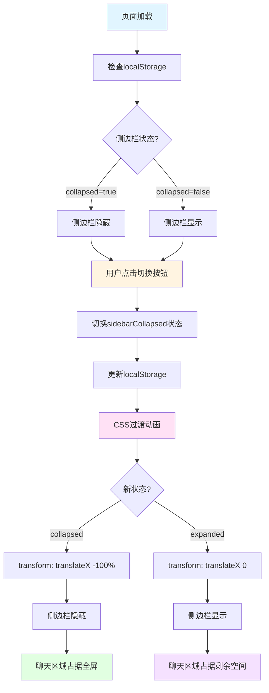
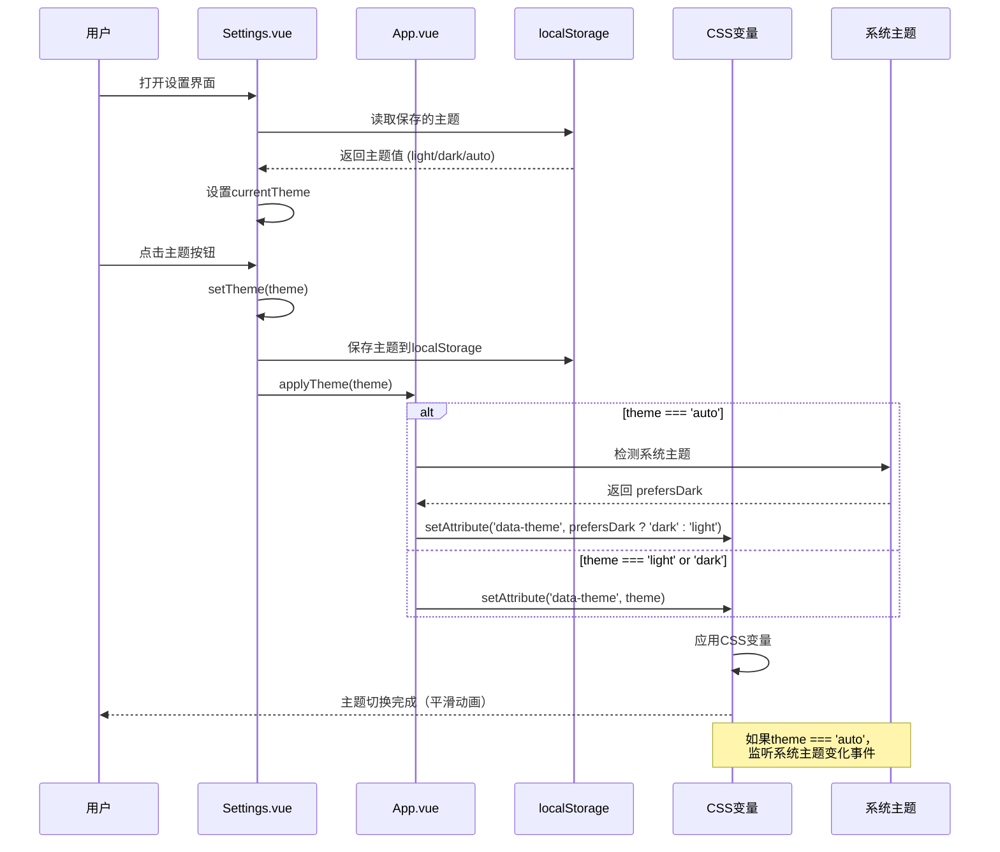
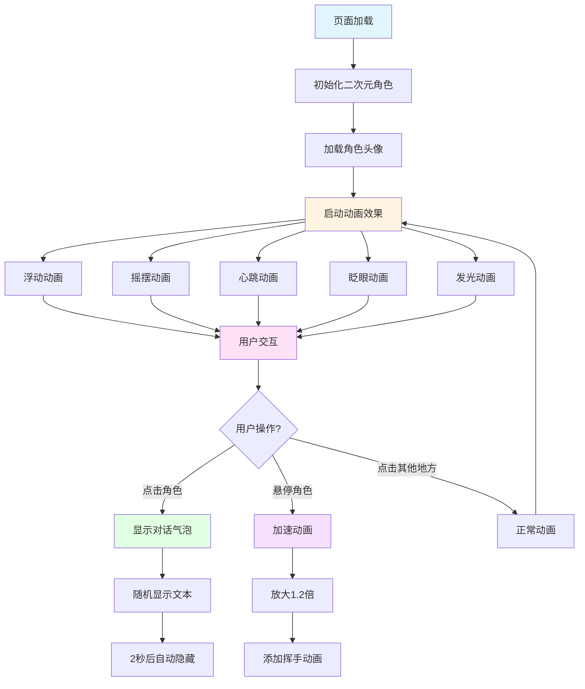
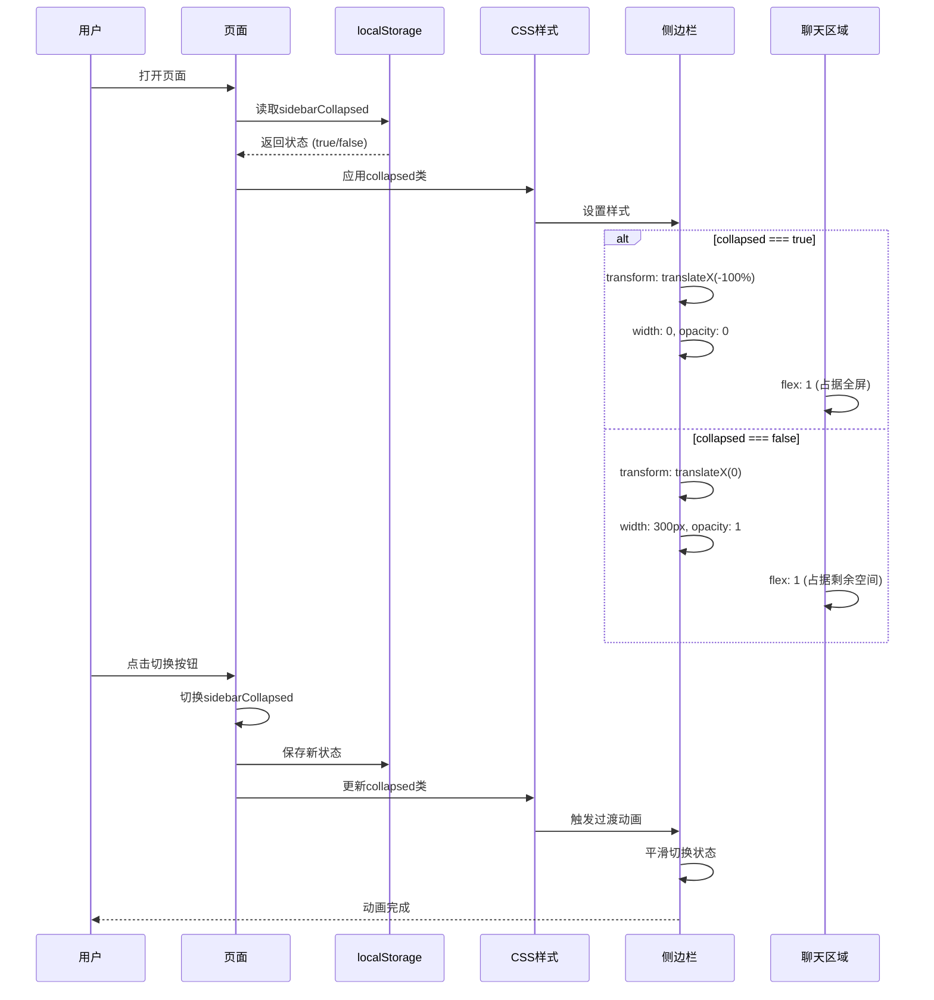
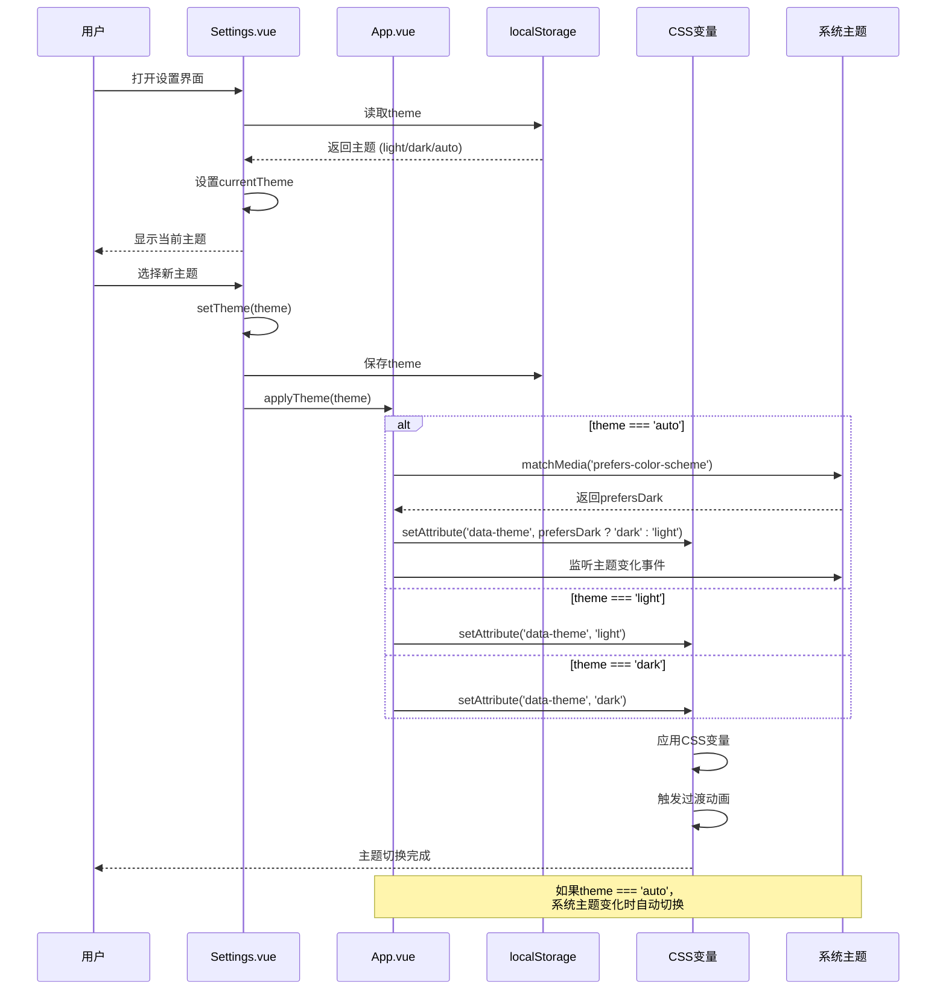
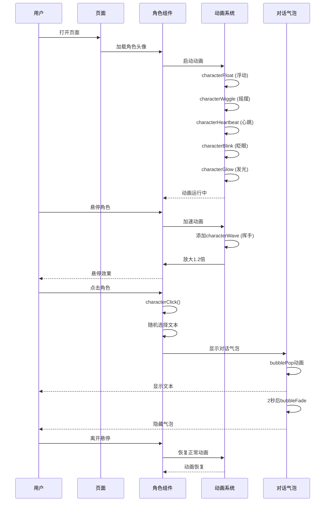

# 响应式设计与主题系统实现详解

## 一、概述

本文档详细介绍了系统中**响应式设计**、**主题系统**和**视觉设计**三个核心功能的实现，包括前端代码的详细解释和完整的流程图。

### 1.1 功能概览

#### 响应式设计
- **功能**：适配不同屏幕尺寸，提供移动端友好的布局
- **特点**：侧边栏可折叠、弹性布局系统、移动端优化
- **实现**：Flexbox布局、CSS变量、媒体查询（隐式）

#### 主题系统
- **功能**：支持深色/浅色主题切换，自动检测系统主题
- **特点**：主题持久化、平滑切换动画、CSS变量驱动
- **实现**：CSS变量、localStorage、系统主题检测

#### 视觉设计
- **功能**：二次元风格角色头像、流畅动画效果、现代化卡片设计
- **特点**：渐变色和阴影效果、图标系统、交互反馈
- **实现**：CSS动画、SVG图标、渐变背景

---

## 二、响应式设计

### 2.1 系统架构

```
┌─────────────────────────────────────────────────────────────┐
│                   响应式布局系统                             │
│  ┌──────────────┐  ┌──────────────┐  ┌──────────────┐    │
│  │  Flexbox布局 │  │  CSS变量     │  │  弹性容器    │    │
│  │  自适应宽度  │  │  动态尺寸    │  │  最小/最大宽 │    │
│  └──────┬───────┘  └──────┬───────┘  └──────┬───────┘    │
│         │                  │                  │            │
│         └──────────────────┴──────────────────┘            │
│                            │                               │
│                            ▼                               │
│  ┌───────────────────────────────────────────────┐        │
│  │  侧边栏（可折叠）                               │        │
│  │  - 默认宽度：300px                             │        │
│  │  - 折叠后：width: 0, transform: translateX(-100%)│    │
│  │  - 平滑过渡动画                                 │        │
│  └───────────────────────────────────────────────┘        │
│                            │                               │
│                            ▼                               │
│  ┌───────────────────────────────────────────────┐        │
│  │  聊天区域（弹性布局）                           │        │
│  │  - flex: 1（占据剩余空间）                     │        │
│  │  - min-width: 0（允许缩小）                    │        │
│  │  - max-width: 100%（限制最大宽度）             │        │
│  └───────────────────────────────────────────────┘        │
└─────────────────────────────────────────────────────────────┘
```

### 2.2 核心实现

#### 2.2.1 容器布局（`Chat.vue`）

```vue
<template>
  <div class="chat-container">
    <!-- 侧边栏（可折叠） -->
    <div class="sidebar" :class="{ collapsed: sidebarCollapsed }">
      <SessionList />
    </div>
    
    <!-- 聊天区域（弹性布局） -->
    <div class="chat-area">
      <div class="chat-header">
        <!-- 侧边栏切换按钮 -->
        <button class="sidebar-toggle-btn" @click="toggleSidebar">
          <!-- 图标 -->
        </button>
        <!-- 其他内容 -->
      </div>
      <!-- 消息容器 -->
      <div class="messages-container">
        <!-- 消息列表 -->
      </div>
      <!-- 输入组件 -->
      <ChatInput />
    </div>
  </div>
</template>

<style scoped>
.chat-container {
  display: flex;              /* Flexbox布局 */
  height: 100vh;              /* 全屏高度 */
  overflow: hidden;           /* 防止整体页面被撑宽 */
  max-width: 100vw;           /* 限制最大宽度为视口宽度 */
}

.sidebar {
  width: 300px;               /* 固定宽度 */
  min-width: 300px;           /* 最小宽度 */
  max-width: 300px;           /* 最大宽度 */
  display: flex;              /* Flexbox布局 */
  flex-direction: column;     /* 垂直布局 */
  background-color: var(--sidebar-bg, var(--bg-color));
  border-right: 1px solid var(--border-subtle, var(--border-color));
  
  /* 平滑过渡动画 */
  transition: transform 0.3s cubic-bezier(0.4, 0, 0.2, 1), 
              opacity 0.3s cubic-bezier(0.4, 0, 0.2, 1),
              width 0.3s cubic-bezier(0.4, 0, 0.2, 1),
              min-width 0.3s cubic-bezier(0.4, 0, 0.2, 1),
              max-width 0.3s cubic-bezier(0.4, 0, 0.2, 1);
  overflow: hidden;
  position: relative;
  z-index: 1;
  will-change: transform, opacity, width;  /* 性能优化 */
  opacity: 1;
}

/* 侧边栏折叠状态 */
.sidebar.collapsed {
  transform: translate3d(-100%, 0, 0);  /* 向左平移隐藏 */
  width: 0;                              /* 宽度为0 */
  min-width: 0;                          /* 最小宽度为0 */
  max-width: 0;                          /* 最大宽度为0 */
  opacity: 0;                            /* 透明 */
  border-right: none;                    /* 移除边框 */
  pointer-events: none;                  /* 禁用交互 */
}

/* 侧边栏内容动画 */
.sidebar > * {
  transition: opacity 0.2s ease, transform 0.2s ease;
  opacity: 1;
  transform: translateX(0);
}

.sidebar.collapsed > * {
  opacity: 0;
  transform: translateX(-10px);
  pointer-events: none;
}

.chat-area {
  flex: 1;                    /* 占据剩余空间 */
  display: flex;              /* Flexbox布局 */
  flex-direction: column;     /* 垂直布局 */
  background-color: var(--bg-color);
  min-width: 0;               /* 关键：允许flex子元素缩小 */
  overflow: hidden;           /* 防止内容溢出 */
}
</style>
```

#### 2.2.2 侧边栏切换逻辑

```javascript
// Chat.vue
const sidebarCollapsed = ref(true);  // 默认收起

// 切换侧边栏
const toggleSidebar = () => {
  sidebarCollapsed.value = !sidebarCollapsed.value;
  // 持久化到localStorage
  localStorage.setItem('sidebarCollapsed', sidebarCollapsed.value.toString());
};

// 从localStorage恢复侧边栏状态
onMounted(() => {
  const saved = localStorage.getItem('sidebarCollapsed');
  if (saved !== null) {
    sidebarCollapsed.value = saved === 'true';
  }
});
```

#### 2.2.3 消息容器响应式

```css
.messages-container {
  flex: 1;                    /* 占据剩余空间 */
  padding: 1rem;
  overflow-y: auto;           /* 垂直滚动 */
  display: flex;              /* Flexbox布局 */
  flex-direction: column;     /* 垂直布局 */
  min-width: 0;               /* 关键：允许flex子元素缩小 */
  max-width: 100%;            /* 限制最大宽度为父容器的100% */
  /* 优化滚动性能 */
  -webkit-overflow-scrolling: touch;
  scroll-behavior: smooth;
  contain: layout style paint;  /* CSS containment优化 */
}

.message {
  display: flex;
  margin-bottom: 1rem;
  max-width: 80%;             /* 消息最大宽度80% */
  min-width: 0;               /* 允许flex子元素缩小 */
  width: fit-content;         /* 根据内容自适应宽度 */
  /* 优化渲染性能 */
  contain: layout style;
  will-change: transform;
}

.message-content {
  padding: 0.75rem 1rem;
  border-radius: var(--radius);
  position: relative;
  min-width: 0;               /* 允许内容缩小 */
  max-width: 100%;            /* 严格限制最大宽度 */
  overflow: hidden;           /* 防止内容溢出 */
  word-wrap: break-word;      /* 长单词自动换行 */
  overflow-wrap: break-word;  /* 长单词自动换行 */
  box-sizing: border-box;     /* 确保padding计算在内 */
}
```

#### 2.2.4 输入框响应式

```css
.messageBox {
  width: 100%;
  height: 100px;
  min-height: 100px;
  display: flex;
  align-items: center;
  justify-content: flex-start;
  background-color: var(--input-box-bg, var(--card-bg));
  padding: 0 20px;
  border-radius: 12px;
  border: 1px solid var(--input-box-border, var(--border-color));
  transition: border-color 0.2s ease, box-shadow 0.2s ease;
}

#messageInput {
  flex: 1;                    /* 占据剩余空间 */
  height: 100%;
  min-height: 100%;
  max-height: 100%;
  background-color: transparent;
  outline: none;
  border: none;
  padding: 12px 15px;
  color: var(--input-text, var(--text-primary));
  font-family: 'Inter', sans-serif;
  font-size: 1rem;
  line-height: 1.6;
  resize: none;               /* 禁止手动调整大小 */
  overflow-y: auto;           /* 垂直滚动 */
  vertical-align: top;
  caret-color: var(--primary-color);
}
```

### 2.3 响应式设计流程图



---

## 三、主题系统

### 3.1 系统架构

```
┌─────────────────────────────────────────────────────────────┐
│                   主题系统架构                               │
│  ┌──────────────┐  ┌──────────────┐  ┌──────────────┐    │
│  │  CSS变量     │  │  Settings.vue│  │   App.vue    │    │
│  │  主题定义    │  │  主题选择UI  │  │  主题应用    │    │
│  └──────┬───────┘  └──────┬───────┘  └──────┬───────┘    │
│         │                  │                  │            │
│         └──────────────────┴──────────────────┘            │
│                            │                               │
│                            ▼                               │
│  ┌───────────────────────────────────────────────┐        │
│  │  localStorage                                 │        │
│  │  - 主题持久化                                 │        │
│  │  - 侧边栏状态                                 │        │
│  └───────────────────────────────────────────────┘        │
│                            │                               │
│                            ▼                               │
│  ┌───────────────────────────────────────────────┐        │
│  │  系统主题检测                                 │        │
│  │  - matchMedia('prefers-color-scheme')         │        │
│  │  - 自动切换主题                               │        │
│  └───────────────────────────────────────────────┘        │
└─────────────────────────────────────────────────────────────┘
```

### 3.2 核心实现

#### 3.2.1 CSS变量定义（`assets/styles.css`）

```css
/* 浅色主题（默认） */
:root[data-theme="light"], :root {
  --primary-color: #4f46e5;
  --primary-light: #6366f1;
  --primary-dark: #4338ca;
  --secondary-color: #10b981;
  --bg-color: #f8fafc;
  --bg-secondary: #f1f5f9;
  --card-bg: #ffffff;
  --text-color: #1e293b;
  --text-primary: #1e293b;
  --text-secondary: #64748b;
  --border-color: #e2e8f0;
  --user-message: #e0e7ff;
  --bot-message: #f1f5f9;
  --danger-color: #ef4444;
  --hover-color: #f1f5f9;
  --input-bg: #ffffff;
  --input-border: #e2e8f0;
  --input-focus-border: #4f46e5;
  --input-text: #1e293b;
  --input-placeholder: #94a3b8;
  --shadow: 0 4px 6px -1px rgba(0, 0, 0, 0.1), 0 2px 4px -1px rgba(0, 0, 0, 0.06);
  --radius: 8px;
  
  /* 代码块颜色 */
  --code-bg: rgba(175, 184, 193, 0.2);
  --code-color: #e01e5a;
  --code-block-bg: #f6f8fa;
  --code-block-color: #24292e;
}

/* 深色主题 - 专业配色方案 */
:root[data-theme="dark"] {
  /* 主色调 - 使用专业的蓝色系 */
  --primary-color: #3b82f6;
  --primary-light: #60a5fa;
  --primary-dark: #2563eb;
  
  /* 次要色 - 柔和的青色 */
  --secondary-color: #06b6d4;
  
  /* 背景色 - 深灰蓝，更专业，层次分明 */
  --bg-color: #0f172a;        /* 主背景 - 最深 */
  --bg-secondary: #1e293b;    /* 侧栏背景 - 略亮 */
  --card-bg: #1e293b;         /* 卡片背景 - 与侧栏一致 */
  --sidebar-bg: #0f172a;      /* 侧栏专用背景 */
  --header-bg: #1e293b;       /* 顶部栏背景 */
  
  /* 文字颜色 - 提高对比度 */
  --text-color: #e2e8f0;
  --text-primary: #f1f5f9;
  --text-secondary: #94a3b8;
  --text-tertiary: #64748b;   /* 更浅的次要文字，用于时间标签 */
  
  /* 边框颜色 - 更柔和的灰色 */
  --border-color: #334155;    /* 更明显的边框 */
  --border-subtle: #1e293b;   /* 微妙的分隔线 */
  
  /* 消息气泡 - 更专业的配色，对比度更高 */
  --user-message: #2563eb;    /* 用户消息 - 蓝色，更明显 */
  --bot-message: #334155;     /* AI消息 - 灰蓝色，略亮 */
  
  /* 危险色 - 柔和的红色 */
  --danger-color: #ef4444;
  
  /* 悬停色 - 中性灰 */
  --hover-color: #252d3d;
  
  /* 输入框颜色 */
  --input-bg: #1a2332;
  --input-border: #2d3748;
  --input-focus-border: #3b82f6;
  --input-text: #e2e8f0;
  --input-placeholder: #64748b;
  
  /* 阴影 - 更柔和 */
  --shadow: 0 4px 6px -1px rgba(0, 0, 0, 0.4), 0 2px 4px -1px rgba(0, 0, 0, 0.3);
  --radius: 8px;
  
  /* 代码块颜色 - 专业配色 */
  --code-bg: rgba(59, 130, 246, 0.15);
  --code-color: #60a5fa;
  --code-block-bg: #0f1419;
  --code-block-color: #cbd5e1;
}
```

#### 3.2.2 主题应用（`App.vue`）

```vue
<template>
  <router-view />
</template>

<script setup>
import { onMounted } from 'vue';

// 初始化主题
onMounted(() => {
  const savedTheme = localStorage.getItem('theme') || 'dark';
  applyTheme(savedTheme);
  
  // 监听系统主题变化（仅在auto模式）
  if (savedTheme === 'auto') {
    window.matchMedia('(prefers-color-scheme: dark)').addEventListener('change', (e) => {
      const currentTheme = localStorage.getItem('theme');
      if (currentTheme === 'auto') {
        applyTheme('auto');
      }
    });
  }
});

const applyTheme = (theme) => {
  const root = document.documentElement;
  
  if (theme === 'auto') {
    // 跟随系统主题
    const prefersDark = window.matchMedia('(prefers-color-scheme: dark)').matches;
    root.setAttribute('data-theme', prefersDark ? 'dark' : 'light');
  } else {
    // 手动设置主题
    root.setAttribute('data-theme', theme);
  }
};
</script>
```

#### 3.2.3 主题选择界面（`Settings.vue`）

```vue
<template>
  <div class="settings-modal">
    <div class="settings-section">
      <h3>常规 - 外观</h3>
      
      <div class="setting-item">
        <label>主题模式</label>
        <div class="theme-options">
          <!-- 浅色主题按钮 -->
          <button
            :class="['theme-btn', { active: currentTheme === 'light' }]"
            @click="setTheme('light')"
          >
            ☀️ 浅色
          </button>
          
          <!-- 深色主题按钮 -->
          <button
            :class="['theme-btn', { active: currentTheme === 'dark' }]"
            @click="setTheme('dark')"
          >
            🌙 深色
          </button>
          
          <!-- 跟随系统主题按钮 -->
          <button
            :class="['theme-btn', { active: currentTheme === 'auto' }]"
            @click="setTheme('auto')"
          >
            💻 跟随系统
          </button>
        </div>
      </div>
    </div>
  </div>
</template>

<script setup>
import { ref, onMounted, defineEmits } from 'vue';

const emits = defineEmits(['close']);
const currentTheme = ref('auto');

// 获取当前主题
onMounted(() => {
  const savedTheme = localStorage.getItem('theme') || 'auto';
  currentTheme.value = savedTheme;
});

// 设置主题
const setTheme = (theme) => {
  currentTheme.value = theme;
  localStorage.setItem('theme', theme);  // 持久化到localStorage
  applyTheme(theme);
};

// 应用主题
const applyTheme = (theme) => {
  const root = document.documentElement;
  
  if (theme === 'auto') {
    // 跟随系统
    const prefersDark = window.matchMedia('(prefers-color-scheme: dark)').matches;
    root.setAttribute('data-theme', prefersDark ? 'dark' : 'light');
  } else {
    root.setAttribute('data-theme', theme);
  }
};
</script>

<style scoped>
.theme-options {
  display: flex;
  gap: 0.5rem;
  flex-wrap: wrap;
}

.theme-btn {
  flex: 1;
  min-width: 100px;
  padding: 0.75rem 1rem;
  border: 2px solid var(--border-color);
  background-color: var(--bg-secondary);
  color: var(--text-color);
  border-radius: 8px;
  cursor: pointer;
  font-size: 0.9rem;
  transition: all 0.2s;  /* 平滑过渡动画 */
}

.theme-btn:hover {
  border-color: var(--primary-color);
  background-color: var(--hover-color);
}

.theme-btn.active {
  border-color: var(--primary-color);
  background-color: var(--primary-color);
  color: white;
}
</style>
```

#### 3.2.4 主题切换平滑动画

```css
/* 全局主题切换动画 */
* {
  transition: background-color 0.3s ease, 
              color 0.3s ease, 
              border-color 0.3s ease;
}

/* 主题按钮过渡动画 */
.theme-btn {
  transition: all 0.2s ease;
}

.theme-btn.active {
  transform: scale(1.05);  /* 轻微放大效果 */
}
```

### 3.3 主题系统流程图



---

## 四、视觉设计

### 4.1 系统架构

```
┌─────────────────────────────────────────────────────────────┐
│                   视觉设计系统                               │
│  ┌──────────────┐  ┌──────────────┐  ┌──────────────┐    │
│  │  二次元角色  │  │  CSS动画     │  │  卡片设计    │    │
│  │  头像系统    │  │  效果系统    │  │  系统        │    │
│  └──────┬───────┘  └──────┬───────┘  └──────┬───────┘    │
│         │                  │                  │            │
│         └──────────────────┴──────────────────┘            │
│                            │                               │
│                            ▼                               │
│  ┌───────────────────────────────────────────────┐        │
│  │  渐变色和阴影效果                             │        │
│  │  - linear-gradient                            │        │
│  │  - box-shadow                                 │        │
│  │  - drop-shadow                                │        │
│  └───────────────────────────────────────────────┘        │
│                            │                               │
│                            ▼                               │
│  ┌───────────────────────────────────────────────┐        │
│  │  图标系统                                     │        │
│  │  - SVG图标                                    │        │
│  │  - 交互反馈                                   │        │
│  └───────────────────────────────────────────────┘        │
└─────────────────────────────────────────────────────────────┘
```

### 4.2 核心实现

#### 4.2.1 二次元角色头像（`Chat.vue`）

```vue
<template>
  <div class="header-center">
    <!-- 二次元角色头像 -->
    <div class="anime-character" @click="characterClick">
      <div class="character-container">
        
        <!-- 星星闪烁效果 -->
        <div class="sparkle sparkle-1">✨</div>
        <div class="sparkle sparkle-2">⭐</div>
        <div class="sparkle sparkle-3">💫</div>
      </div>
      <!-- 对话气泡 -->
      <div class="character-bubble" v-if="showBubble">
        <span>{{ bubbleText }}</span>
      </div>
    </div>
    <!-- 其他内容 -->
  </div>
</template>

<script setup>
const showBubble = ref(false);
const bubbleText = ref('');

// 二次元小人点击事件
const characterClick = () => {
  const texts = [
    '你好呀！✨',
    '需要帮助吗？😊',
    '一起分析日志吧！💪',
    'LogOracle 最棒了！🌟',
    '加油加油！🎉'
  ];
  bubbleText.value = texts[Math.floor(Math.random() * texts.length)];
  showBubble.value = true;
  setTimeout(() => {
    showBubble.value = false;
  }, 2000);
};

// 图片加载失败处理
const handleImageError = (event) => {
  event.target.src = 'https://api.dicebear.com/7.x/fun-emoji/svg?seed=LogOracle&backgroundColor=b6e3ff,c0aede,d1d4f9,ffd5dc';
};
</script>

<style scoped>
.anime-character {
  position: absolute;
  left: 600px;
  top: 50%;
  transform: translateY(-50%);
  width: 70px;
  height: 70px;
  z-index: 10;
  cursor: pointer;
  user-select: none;
}

.character-container {
  position: relative;
  width: 100%;
  height: 100%;
  /* 多重动画效果 */
  animation: characterFloat 3s ease-in-out infinite, 
             characterWiggle 2.5s ease-in-out infinite, 
             characterHeartbeat 2s ease-in-out infinite;
  transform-origin: center center;
}

/* 悬停效果 */
.anime-character:hover .character-container {
  animation: characterFloat 1s ease-in-out infinite, 
             characterWiggle 1s ease-in-out infinite, 
             characterHeartbeat 1s ease-in-out infinite, 
             characterWave 0.5s ease-in-out infinite;
  transform: scale(1.2);
}

/* 点击效果 */
.anime-character:active .character-container {
  animation-play-state: paused;
  transform: scale(0.9);
}

.character-img {
  width: 100%;
  height: 100%;
  object-fit: contain;
  filter: drop-shadow(0 4px 12px rgba(59, 130, 246, 0.3));
  animation: characterBlink 3s ease-in-out infinite, 
             characterGlow 2s ease-in-out infinite;
  border-radius: 50%;
  background: radial-gradient(circle, rgba(59, 130, 246, 0.1) 0%, transparent 70%);
}

/* 浮动动画 */
@keyframes characterFloat {
  0%, 100% {
    transform: translateY(0);
  }
  50% {
    transform: translateY(-12px);
  }
}

/* 摇摆动画 */
@keyframes characterWiggle {
  0%, 100% {
    transform: rotate(0deg);
  }
  20% {
    transform: rotate(-8deg);
  }
  40% {
    transform: rotate(8deg);
  }
  60% {
    transform: rotate(-5deg);
  }
  80% {
    transform: rotate(5deg);
  }
}

/* 心跳动画 */
@keyframes characterHeartbeat {
  0%, 100% {
    transform: scale(1);
  }
  10%, 30% {
    transform: scale(1.05);
  }
  20%, 40% {
    transform: scale(1);
  }
}

/* 挥手动画 */
@keyframes characterWave {
  0%, 100% {
    transform: rotate(0deg);
  }
  25% {
    transform: rotate(-15deg);
  }
  75% {
    transform: rotate(15deg);
  }
}

/* 眨眼动画 */
@keyframes characterBlink {
  0%, 85%, 100% {
    opacity: 1;
  }
  87%, 93% {
    opacity: 0.1;
  }
}

/* 发光动画 */
@keyframes characterGlow {
  0%, 100% {
    filter: drop-shadow(0 4px 12px rgba(59, 130, 246, 0.3));
  }
  50% {
    filter: drop-shadow(0 4px 20px rgba(59, 130, 246, 0.5));
  }
}

/* 星星闪烁效果 */
.sparkle {
  position: absolute;
  font-size: 12px;
  pointer-events: none;
  animation: sparkleFloat 3s ease-in-out infinite;
}

.sparkle-1 {
  top: -10px;
  left: 20%;
  animation-delay: 0s;
}

.sparkle-2 {
  top: 10px;
  right: 15%;
  animation-delay: 1s;
}

.sparkle-3 {
  bottom: -5px;
  left: 50%;
  animation-delay: 2s;
}

@keyframes sparkleFloat {
  0%, 100% {
    opacity: 0;
    transform: translateY(0) scale(0.5);
  }
  50% {
    opacity: 1;
    transform: translateY(-15px) scale(1);
  }
}

/* 对话气泡 */
.character-bubble {
  position: absolute;
  bottom: 100%;
  left: 50%;
  transform: translateX(-50%);
  margin-bottom: 10px;
  padding: 0.5rem 0.75rem;
  background: var(--primary-color);
  color: white;
  border-radius: 12px;
  font-size: 0.75rem;
  white-space: nowrap;
  animation: bubblePop 0.3s ease-out, bubbleFade 2s ease-out 0.3s forwards;
  box-shadow: 0 4px 12px rgba(129, 140, 248, 0.4);
  z-index: 10;
  pointer-events: none;
}

.character-bubble::after {
  content: '';
  position: absolute;
  top: 100%;
  left: 50%;
  transform: translateX(-50%);
  border: 6px solid transparent;
  border-top-color: var(--primary-color);
}

@keyframes bubblePop {
  from {
    opacity: 0;
    transform: translateX(-50%) scale(0.5);
  }
  to {
    opacity: 1;
    transform: translateX(-50%) scale(1);
  }
}

@keyframes bubbleFade {
  from {
    opacity: 1;
  }
  to {
    opacity: 0;
    transform: translateX(-50%) translateY(-10px);
  }
}
</style>
```

#### 4.2.2 卡片设计系统

```css
/* 功能卡片 */
.feature-card {
  display: flex;
  align-items: center;
  gap: 1rem;
  padding: 1.25rem;
  background-color: var(--card-bg);
  border-radius: 12px;
  border: 1px solid var(--border-color);
  transition: all 0.3s ease;
  cursor: default;
}

.feature-card:hover {
  transform: translateY(-2px);      /* 向上移动 */
  box-shadow: var(--shadow);        /* 阴影效果 */
  border-color: var(--primary-color); /* 边框高亮 */
}

/* 定价卡片 */
.pricing-card {
  position: relative;
  width: 100%;
  max-width: 420px;
  padding: 4px;
  background: linear-gradient(135deg, var(--primary-color) 0%, var(--primary-dark) 100%);
  border-radius: 12px;
  animation: slideUp 0.4s cubic-bezier(0.4, 0, 0.2, 1);
  box-shadow: 0 20px 60px rgba(0, 0, 0, 0.4);
  border: 1px solid rgba(59, 130, 246, 0.2);
}

@keyframes slideUp {
  from {
    opacity: 0;
    transform: translateY(30px) scale(0.95);
  }
  to {
    opacity: 1;
    transform: translateY(0) scale(1);
  }
}

/* 消息卡片 */
.message-content {
  padding: 0.75rem 1rem;
  border-radius: var(--radius);
  position: relative;
  box-shadow: 0 1px 3px rgba(0, 0, 0, 0.1);
  transition: box-shadow 0.2s ease;
}

.message-content:hover {
  box-shadow: 0 2px 6px rgba(0, 0, 0, 0.15);
}
```

#### 4.2.3 渐变色和阴影效果

```css
/* 用户头像渐变色 */
.user-avatar {
  background: linear-gradient(135deg, var(--primary-color) 0%, var(--primary-dark) 100%);
  color: white;
  border: 2px solid rgba(59, 130, 246, 0.3);
  box-shadow: 0 2px 8px rgba(59, 130, 246, 0.2);
}

/* AI头像渐变色 */
.bot-avatar {
  background: linear-gradient(135deg, var(--secondary-color) 0%, #0891b2 100%);
  color: white;
  border: 2px solid rgba(6, 182, 212, 0.3);
  box-shadow: 0 2px 8px rgba(6, 182, 212, 0.2);
}

/* 按钮渐变色 */
.signup-btn {
  background: linear-gradient(135deg, var(--primary-color) 0%, var(--primary-dark) 100%);
  border: 1px solid rgba(59, 130, 246, 0.3);
  box-shadow: 0 4px 12px rgba(59, 130, 246, 0.2);
  transition: all 0.2s ease;
}

.signup-btn:hover {
  background: linear-gradient(135deg, var(--primary-light) 0%, var(--primary-color) 100%);
  transform: translateY(-1px);
  box-shadow: 0 6px 20px rgba(59, 130, 246, 0.3);
  border-color: rgba(59, 130, 246, 0.5);
}

/* 全局阴影定义 */
:root[data-theme="light"] {
  --shadow: 0 4px 6px -1px rgba(0, 0, 0, 0.1), 0 2px 4px -1px rgba(0, 0, 0, 0.06);
}

:root[data-theme="dark"] {
  --shadow: 0 4px 6px -1px rgba(0, 0, 0, 0.4), 0 2px 4px -1px rgba(0, 0, 0, 0.3);
}
```

#### 4.2.4 图标系统

```vue
<template>
  <!-- SVG图标 -->
  <button class="icon-btn" @click="handleClearHistory" title="清空当前会话">
    <svg xmlns="http://www.w3.org/2000/svg" width="18" height="18" viewBox="0 0 24 24" fill="none" stroke="currentColor" stroke-width="2" stroke-linecap="round" stroke-linejoin="round">
      <polyline points="3 6 5 6 21 6"></polyline>
      <path d="M19 6v14a2 2 0 0 1-2 2H7a2 2 0 0 1-2-2V6m3 0V4a2 2 0 0 1 2-2h4a2 2 0 0 1 2 2v2"></path>
    </svg>
  </button>
</template>

<style scoped>
.icon-btn {
  background: var(--bg-secondary);
  border: 1px solid var(--border-color);
  color: var(--text-secondary);
  padding: 0.5rem;
  border-radius: var(--radius);
  cursor: pointer;
  transition: all 0.2s ease;
  display: flex;
  align-items: center;
  justify-content: center;
  width: 36px;
  height: 36px;
}

.icon-btn:hover {
  background: var(--hover-color);
  color: var(--text-primary);
  border-color: var(--border-color);
  transform: scale(1.1);  /* 轻微放大 */
}

.logout-btn:hover {
  background: rgba(239, 68, 68, 0.1);
  color: var(--danger-color);
  border-color: rgba(239, 68, 68, 0.3);
}
</style>
```

#### 4.2.5 动画效果系统

```css
/* 淡入向上动画 */
@keyframes fadeInUp {
  from {
    opacity: 0;
    transform: translate3d(0, 10px, 0);
  }
  to {
    opacity: 1;
    transform: translate3d(0, 0, 0);
  }
}

/* 淡入动画 */
@keyframes fadeIn {
  from {
    opacity: 0;
  }
  to {
    opacity: 1;
  }
}

/* 滑入动画 */
@keyframes slideInItem {
  from {
    opacity: 0;
    transform: translateX(-15px);
  }
  to {
    opacity: 1;
    transform: translateX(0);
  }
}

/* 应用动画 */
.header-center {
  animation: fadeInUp 0.4s ease-out;
  will-change: transform, opacity;
}

.user-info {
  animation: fadeInUp 0.3s ease-out 0.2s backwards;
}

.session-item {
  animation: slideInItem 0.3s ease-out backwards;
}

/* 为每个会话项添加延迟动画 */
.session-item:nth-child(1) { animation-delay: 0.05s; }
.session-item:nth-child(2) { animation-delay: 0.1s; }
.session-item:nth-child(3) { animation-delay: 0.15s; }
.session-item:nth-child(4) { animation-delay: 0.2s; }
.session-item:nth-child(5) { animation-delay: 0.25s; }
.session-item:nth-child(n+6) { animation-delay: 0.3s; }
```

### 4.3 视觉设计流程图



---

## 五、完整工作流程

### 5.1 响应式设计完整流程



### 5.2 主题系统完整流程



### 5.3 视觉设计完整流程



---

## 六、代码文件位置

### 6.1 响应式设计

**前端代码**：
1. **主布局**：`vue_frontend/src/views/Chat.vue`
   - `.chat-container`：主容器
   - `.sidebar`：侧边栏（可折叠）
   - `.chat-area`：聊天区域（弹性布局）
   - `toggleSidebar()`：侧边栏切换逻辑

2. **消息组件**：`vue_frontend/src/components/ChatMessage.vue`
   - `.message`：消息容器（响应式宽度）
   - `.message-content`：消息内容（自适应）

3. **输入组件**：`vue_frontend/src/components/ChatInput.vue`
   - `.messageBox`：输入框容器
   - `#messageInput`：输入框（弹性布局）

### 6.2 主题系统

**前端代码**：
1. **主题定义**：`vue_frontend/src/assets/styles.css`
   - `:root[data-theme="light"]`：浅色主题变量
   - `:root[data-theme="dark"]`：深色主题变量

2. **主题应用**：`vue_frontend/src/App.vue`
   - `applyTheme()`：应用主题函数
   - 系统主题检测和监听

3. **主题选择**：`vue_frontend/src/components/Settings.vue`
   - 主题选择界面
   - 主题切换逻辑

### 6.3 视觉设计

**前端代码**：
1. **角色头像**：`vue_frontend/src/views/Chat.vue`
   - `.anime-character`：角色容器
   - `.character-container`：角色动画容器
   - `characterClick()`：点击事件处理
   - 各种动画关键帧

2. **卡片设计**：`vue_frontend/src/views/Chat.vue`
   - `.feature-card`：功能卡片
   - `.pricing-card`：定价卡片
   - `.message-content`：消息卡片

3. **图标系统**：`vue_frontend/src/views/Chat.vue`
   - `.icon-btn`：图标按钮
   - SVG图标定义

4. **动画效果**：`vue_frontend/src/views/Chat.vue`
   - `@keyframes`：动画关键帧定义
   - 各种动画效果

---

## 七、关键技术点

### 7.1 响应式设计关键技术

1. **Flexbox布局**：
   - 使用`display: flex`实现弹性布局
   - `flex: 1`让元素占据剩余空间
   - `min-width: 0`允许flex子元素缩小

2. **CSS过渡动画**：
   - 使用`transition`实现平滑过渡
   - `cubic-bezier`缓动函数提供自然动画
   - `will-change`优化动画性能

3. **侧边栏折叠**：
   - 使用`transform: translateX(-100%)`隐藏侧边栏
   - 使用`width: 0`和`opacity: 0`完全隐藏
   - `pointer-events: none`禁用交互

4. **状态持久化**：
   - 使用`localStorage`保存侧边栏状态
   - 页面加载时恢复状态

### 7.2 主题系统关键技术

1. **CSS变量**：
   - 使用`:root[data-theme]`定义主题变量
   - 所有颜色和样式都使用CSS变量
   - 切换主题只需改变`data-theme`属性

2. **主题持久化**：
   - 使用`localStorage`保存主题选择
   - 页面加载时自动应用保存的主题

3. **系统主题检测**：
   - 使用`window.matchMedia('prefers-color-scheme: dark')`检测系统主题
   - 监听系统主题变化事件
   - 自动切换主题（auto模式）

4. **平滑切换动画**：
   - 使用CSS `transition`实现平滑过渡
   - 全局过渡动画确保一致性

### 7.3 视觉设计关键技术

1. **CSS动画**：
   - 使用`@keyframes`定义动画关键帧
   - 多重动画组合（浮动、摇摆、心跳等）
   - `animation-delay`实现错开动画

2. **渐变色**：
   - 使用`linear-gradient`实现渐变色
   - `radial-gradient`实现 radial 渐变
   - 主题变量驱动的渐变色

3. **阴影效果**：
   - 使用`box-shadow`实现卡片阴影
   - 使用`drop-shadow`实现图片阴影
   - 主题变量驱动的阴影颜色

4. **交互反馈**：
   - 悬停效果（`:hover`）
   - 点击效果（`:active`）
   - 过渡动画提供平滑反馈

5. **性能优化**：
   - 使用`will-change`提示浏览器优化
   - 使用`transform`和`opacity`实现动画（GPU加速）
   - 使用`contain`属性优化渲染

---

## 八、使用示例

### 8.1 响应式设计示例

**侧边栏切换**：
```javascript
// Chat.vue
const sidebarCollapsed = ref(true);

const toggleSidebar = () => {
  sidebarCollapsed.value = !sidebarCollapsed.value;
  localStorage.setItem('sidebarCollapsed', sidebarCollapsed.value.toString());
};
```

**CSS响应式样式**：
```css
.sidebar {
  width: 300px;
  transition: transform 0.3s ease, width 0.3s ease;
}

.sidebar.collapsed {
  transform: translateX(-100%);
  width: 0;
  opacity: 0;
}
```

### 8.2 主题系统示例

**主题切换**：
```javascript
// Settings.vue
const setTheme = (theme) => {
  currentTheme.value = theme;
  localStorage.setItem('theme', theme);
  applyTheme(theme);
};

const applyTheme = (theme) => {
  const root = document.documentElement;
  if (theme === 'auto') {
    const prefersDark = window.matchMedia('(prefers-color-scheme: dark)').matches;
    root.setAttribute('data-theme', prefersDark ? 'dark' : 'light');
  } else {
    root.setAttribute('data-theme', theme);
  }
};
```

**CSS变量使用**：
```css
:root[data-theme="dark"] {
  --bg-color: #0f172a;
  --text-color: #e2e8f0;
}

.component {
  background-color: var(--bg-color);
  color: var(--text-color);
}
```

### 8.3 视觉设计示例

**角色动画**：
```css
.character-container {
  animation: characterFloat 3s ease-in-out infinite, 
             characterWiggle 2.5s ease-in-out infinite, 
             characterHeartbeat 2s ease-in-out infinite;
}

@keyframes characterFloat {
  0%, 100% { transform: translateY(0); }
  50% { transform: translateY(-12px); }
}
```

**渐变色按钮**：
```css
.signup-btn {
  background: linear-gradient(135deg, var(--primary-color) 0%, var(--primary-dark) 100%);
  box-shadow: 0 4px 12px rgba(59, 130, 246, 0.2);
  transition: all 0.2s ease;
}

.signup-btn:hover {
  transform: translateY(-1px);
  box-shadow: 0 6px 20px rgba(59, 130, 246, 0.3);
}
```

---

## 九、总结

### 9.1 响应式设计

- **功能**：适配不同屏幕尺寸，提供移动端友好的布局
- **特点**：侧边栏可折叠、弹性布局系统、状态持久化
- **实现**：Flexbox布局 + CSS过渡动画 + localStorage

### 9.2 主题系统

- **功能**：支持深色/浅色主题切换，自动检测系统主题
- **特点**：主题持久化、平滑切换动画、CSS变量驱动
- **实现**：CSS变量 + localStorage + 系统主题检测

### 9.3 视觉设计

- **功能**：二次元风格角色头像、流畅动画效果、现代化卡片设计
- **特点**：渐变色和阴影效果、图标系统、交互反馈
- **实现**：CSS动画 + 渐变色 + 阴影效果 + SVG图标

### 9.4 技术亮点

1. **性能优化**：使用`will-change`、`transform`、`contain`等属性优化性能
2. **用户体验**：平滑的动画过渡、交互反馈、视觉反馈
3. **可维护性**：CSS变量驱动、模块化设计、易于扩展
4. **兼容性**：支持现代浏览器、响应式设计、移动端友好

---

**文档版本**：1.0  
**最后更新**：2025年  
**作者**：系统开发团队

