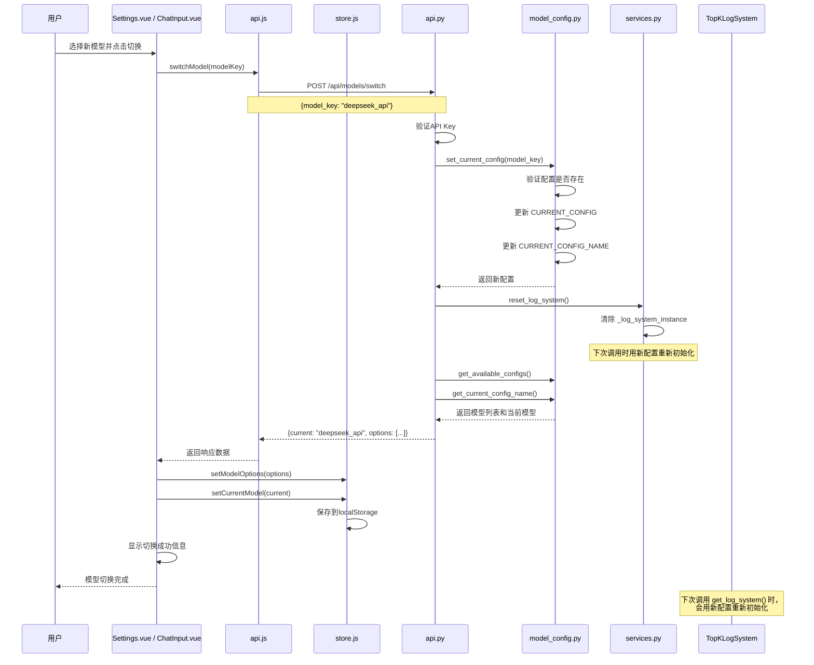
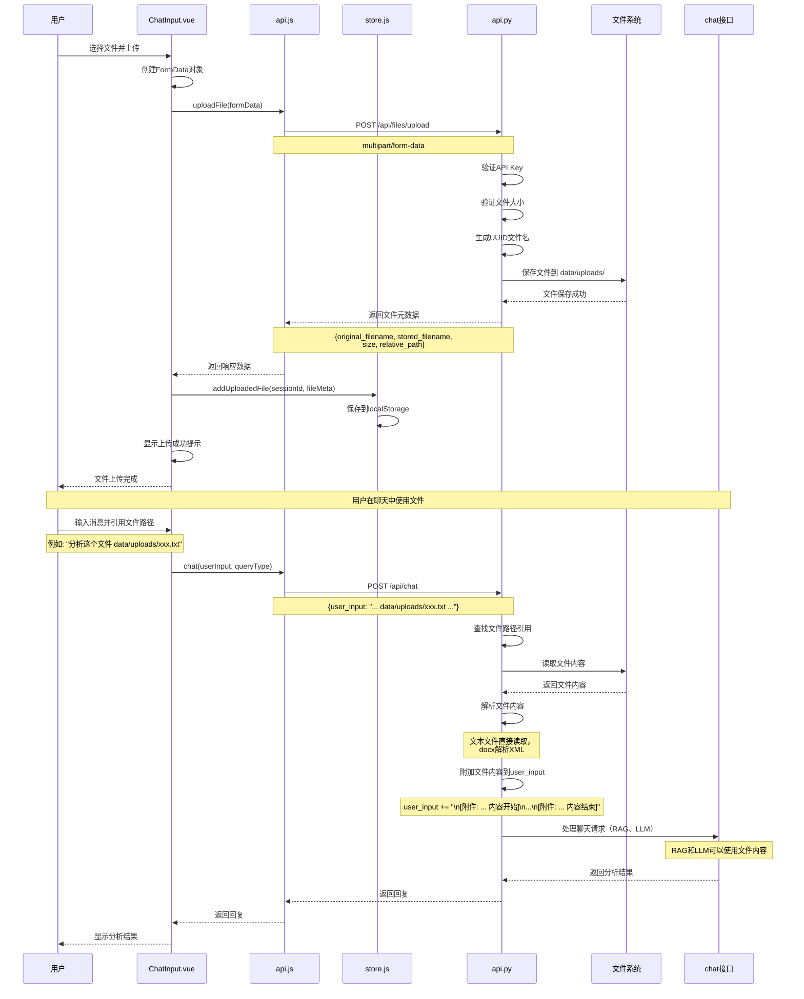
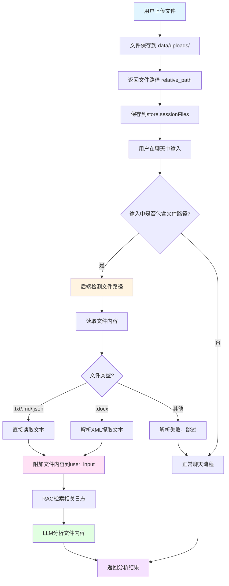
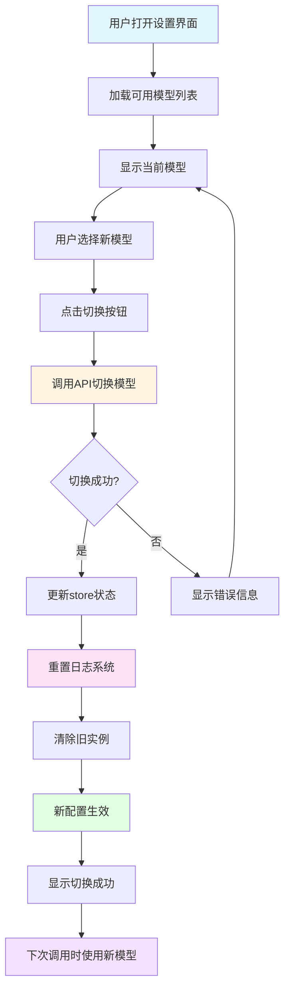
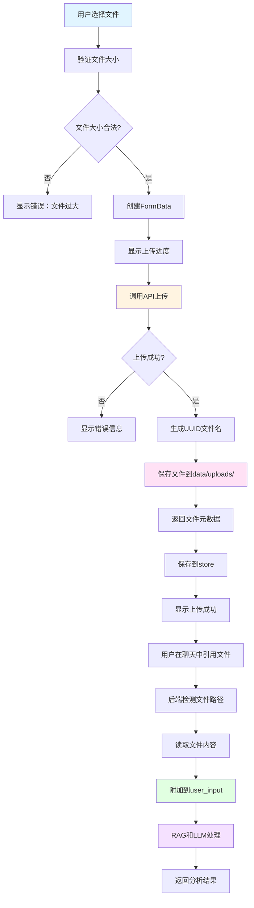

# 模型切换与文件上传功能实现详解

## 一、概述

本文档详细介绍了系统中**模型切换**和**文件上传**两个核心功能的实现，包括前后端代码的详细解释和完整的流程图。

### 1.1 功能概览

#### 模型切换功能
- **功能**：允许用户在不同的大语言模型配置之间切换
- **支持**：DeepSeek API、本地 Ollama 模型等多种配置
- **特点**：切换后自动重置日志系统，确保新模型配置生效

#### 文件上传功能
- **功能**：允许用户上传文件，并在聊天中引用文件内容
- **支持格式**：文本文件（.txt, .md, .json, .jsonl, .csv）、Word文档（.docx）
- **特点**：文件内容自动解析并附加到用户输入，供RAG和LLM使用

---

## 二、模型切换功能

### 2.1 系统架构

```
┌─────────────────────────────────────────────────────────────┐
│                      前端 (Vue.js)                          │
│  ┌──────────────┐  ┌──────────────┐  ┌──────────────┐    │
│  │ Settings.vue │  │ ChatInput.vue│  │   store.js   │    │
│  │  设置界面    │  │  输入组件    │  │  状态管理    │    │
│  └──────┬───────┘  └──────┬───────┘  └──────┬───────┘    │
│         │                  │                  │            │
│         └──────────────────┴──────────────────┘            │
│                            │                               │
│                            ▼                               │
│                    ┌──────────────┐                       │
│                    │   api.js     │                       │
│                    │  API调用层   │                       │
│                    └──────┬───────┘                       │
└───────────────────────────┼───────────────────────────────┘
                            │ HTTP POST /api/models/switch
                            ▼
┌─────────────────────────────────────────────────────────────┐
│                      后端 (Django)                          │
│  ┌──────────────┐  ┌──────────────┐  ┌──────────────┐    │
│  │   api.py     │  │model_config.py│  │ services.py  │    │
│  │  API接口     │  │  配置管理     │  │ 服务层       │    │
│  └──────┬───────┘  └──────┬───────┘  └──────┬───────┘    │
│         │                  │                  │            │
│         └──────────────────┴──────────────────┘            │
│                            │                               │
│                            ▼                               │
│              ┌───────────────────────────┐                │
│              │   TopKLogSystem 实例      │                │
│              │    (重置以应用新配置)      │                │
│              └───────────────────────────┘                │
└─────────────────────────────────────────────────────────────┘
```

### 2.2 后端实现

#### 2.2.1 模型配置管理（`model_config.py`）

**核心功能**：管理可用的模型配置，提供配置切换功能

```python
# 可用模型配置字典
AVAILABLE_CONFIGS = {
    "deepseek_api": {
        "name": "DeepSeek API",
        "description": "云端推理，免部署，适合需要高可靠性的场景",
        "config": {
            "llm": "deepseek-chat",
            "embedding_model": "nomic-embed-text",
            "llm_timeout": 60.0,
            "embedding_timeout": 180.0,
            "context_window": 32768,
            "use_api": True,  # 使用API模式
        },
    },
    "fast_local": {
        "name": "Qwen 3B (本地快速)",
        "description": "Qwen2.5 3B，本地部署，速度快，适合开发调试",
        "config": {
            "llm": "qwen2.5:3b",
            "embedding_model": "nomic-embed-text",
            "llm_timeout": 300.0,
            "embedding_timeout": 180.0,
            "context_window": 4096,
            "use_api": False,  # 使用本地Ollama
        },
    },
    # ... 其他配置
}

# 当前配置
CURRENT_CONFIG_NAME = "high_quality_local"
CURRENT_CONFIG = dict(AVAILABLE_CONFIGS[CURRENT_CONFIG_NAME]["config"])

def get_available_configs():
    """
    返回可选模型配置列表（不包含敏感信息）
    
    返回格式：
    [
        {
            "key": "deepseek_api",
            "name": "DeepSeek API",
            "description": "云端推理，免部署...",
            "llm": "deepseek-chat",
            "use_api": True,
            "context_window": 32768
        },
        ...
    ]
    """
    options = []
    for key, info in AVAILABLE_CONFIGS.items():
        config = info["config"]
        options.append({
            "key": key,
            "name": info["name"],
            "description": info.get("description", ""),
            "llm": config.get("llm", ""),
            "use_api": config.get("use_api", False),
            "context_window": config.get("context_window"),
        })
    return options

def get_current_config_name() -> str:
    """返回当前生效的配置 key"""
    return CURRENT_CONFIG_NAME

def set_current_config(name: str) -> dict:
    """
    切换当前配置
    
    流程：
    1. 验证配置名称是否有效
    2. 更新全局配置字典
    3. 更新当前配置名称
    4. 返回新配置
    
    注意：使用 clear() 和 update() 保持同一个 CURRENT_CONFIG 引用，
    这样其他模块引用 CURRENT_CONFIG 时自动获得新配置
    """
    global CURRENT_CONFIG_NAME
    if name not in AVAILABLE_CONFIGS:
        raise KeyError(f"未知的模型配置: {name}")

    config = AVAILABLE_CONFIGS[name]["config"]
    CURRENT_CONFIG.clear()  # 清空当前配置
    CURRENT_CONFIG.update(config)  # 更新为新配置
    CURRENT_CONFIG_NAME = name
    return CURRENT_CONFIG
```

#### 2.2.2 API接口（`api.py`）

**获取模型列表接口**：

```python
@router.get("/models", response={200: ModelsOut})
def list_models(request):
    """
    获取可用模型配置列表
    
    返回：
    {
        "current": "deepseek_api",  # 当前模型配置key
        "options": [                # 可用模型列表
            {
                "key": "deepseek_api",
                "name": "DeepSeek API",
                "description": "云端推理，免部署...",
                "llm": "deepseek-chat",
                "use_api": True,
                "context_window": 32768
            },
            ...
        ]
    }
    """
    options = get_available_configs()
    current = get_current_config_name()
    
    return {"current": current, "options": options}
```

**切换模型接口**：

```python
@router.post("/models/switch", response={200: ModelsOut, 400: ErrorResponse})
def switch_model(request, data: ModelSwitchIn):
    """
    切换模型配置
    
    请求体：
    {
        "model_key": "deepseek_api"  # 要切换的模型配置key
    }
    
    流程：
    1. 验证用户身份（通过API Key）
    2. 切换模型配置（set_current_config）
    3. 重置日志系统（reset_log_system）
    4. 返回更新后的模型列表和当前模型
    
    重要：重置日志系统是为了确保新模型配置生效，
    因为 TopKLogSystem 在初始化时会读取 CURRENT_CONFIG
    """
    try:
        # 1. 切换配置
        set_current_config(data.model_key)
        
        # 2. 重置日志系统（关键步骤）
        # 这会清除旧的 TopKLogSystem 实例，下次调用时会用新配置重新初始化
        services.reset_log_system()
        
        print(f"🧠 [模型切换成功] 当前模型: {get_current_config_name()}")
    except KeyError:
        print(f"❌ [模型切换失败] 无效的模型标识: {data.model_key}")
        return 400, {"error": "无效的模型标识"}

    # 3. 返回更新后的配置
    options = get_available_configs()
    current = get_current_config_name()
    
    return {"current": current, "options": options}
```

#### 2.2.3 服务层（`services.py`）

**重置日志系统**：

```python
def reset_log_system():
    """
    在模型配置切换后重置 TopKLogSystem 实例
    
    原理：
    - TopKLogSystem 是单例模式，初始化时会读取 CURRENT_CONFIG
    - 切换配置后，需要清除旧实例，让系统用新配置重新初始化
    - 使用线程锁确保线程安全
    """
    global _log_system_instance

    with _log_system_lock:
        if _log_system_instance is not None:
            import logging
            logger = logging.getLogger(__name__)
            logger.info("重置 TopKLogSystem 实例以应用新的模型配置")
            _log_system_instance = None  # 清除实例，下次调用时重新初始化
```

### 2.3 前端实现

#### 2.3.1 API调用层（`api.js`）

```javascript
export default {
  // 获取可用模型配置
  getModels() {
    return api.get('/models');
  },

  // 切换当前模型
  switchModel(modelKey) {
    return api.post('/models/switch', { model_key: modelKey });
  },
};
```

#### 2.3.2 状态管理（`store.js`）

```javascript
export const useStore = defineStore('main', {
  state: () => ({
    currentModel: localStorage.getItem('currentModel') || '',  // 当前模型key
    models: [],  // 模型列表
  }),
  
  actions: {
    // 保存模型列表
    setModelOptions(options) {
      this.models = options || [];
    },

    // 更新当前模型
    setCurrentModel(modelKey) {
      this.currentModel = modelKey;
      if (modelKey) {
        localStorage.setItem('currentModel', modelKey);  // 持久化到本地存储
      } else {
        localStorage.removeItem('currentModel');
      }
    },
  }
});
```

#### 2.3.3 设置界面（`Settings.vue`）

```vue
<template>
  <div class="settings-modal">
    <div class="settings-section">
      <h3>模型选择</h3>
      <div class="setting-item">
        <label>当前模型</label>
        <div class="model-select">
          <!-- 模型选择下拉框 -->
          <select v-model="selectedModel">
            <option v-for="opt in models" :key="opt.key" :value="opt.key">
              {{ opt.name }} — {{ opt.llm }}
            </option>
          </select>
          <!-- 切换按钮 -->
          <button class="switch-btn" @click="switchModel">切换</button>
        </div>
        <p class="help-text">
          切换模型会在后端重新初始化模型实例（可能需要一些时间）。
          如果切换到本地模型，请确认已在服务器上执行 ollama pull。
        </p>
      </div>
    </div>
  </div>
</template>

<script setup>
import { ref, onMounted } from 'vue';
import { useStore } from '../store';
import api from '../api';

const store = useStore();
const models = ref([]);
const selectedModel = ref('');

// 组件挂载时加载模型列表
onMounted(() => {
  if (store.models && store.models.length > 0) {
    // 从store获取（Chat.vue已经加载过）
    models.value = store.models;
    selectedModel.value = store.currentModel || models.value[0]?.key;
  } else {
    // 从API加载
    api.getModels().then(resp => {
      const data = resp?.data || {};
      models.value = data.options || [];
      selectedModel.value = data.current || models.value[0]?.key;
      store.setModelOptions(models.value);
      store.setCurrentModel(selectedModel.value);
    });
  }
});

// 切换模型
const switchModel = async () => {
  if (!selectedModel.value) return;
  try {
    const resp = await api.switchModel(selectedModel.value);
    const data = resp?.data || {};
    
    // 更新store
    if (data.options) store.setModelOptions(data.options);
    if (data.current) store.setCurrentModel(data.current);
    
    alert('模型切换成功: ' + data.current);
  } catch (err) {
    alert('模型切换失败: ' + (err.response?.data?.error || err.message));
  }
};
</script>
```

#### 2.3.4 输入组件（`ChatInput.vue`）

```vue
<template>
  <div class="chat-input-wrapper">
    <div class="select-row">
      <!-- 模型选择下拉框 -->
      <select
        v-model="selectedModel"
        class="query-type-select model-select"
        :disabled="loading || modelOptions.length === 0"
        @change="handleModelChange"
      >
        <option value="" disabled>选择模型</option>
        <option
          v-for="model in modelOptions"
          :key="model.key"
          :value="model.key"
        >
          {{ model.name }}
        </option>
      </select>
    </div>
    <!-- ... 其他输入组件 ... -->
  </div>
</template>

<script setup>
import { ref, computed, onMounted } from 'vue';
import { useStore } from '../store';
import api from '../api';

const store = useStore();
const modelOptions = computed(() => store.models);
const selectedModel = ref(store.currentModel || '');

// 模型切换处理
const handleModelChange = async () => {
  const targetModel = selectedModel.value;
  if (!targetModel) return;

  const previousModel = store.currentModel;
  try {
    // 调用API切换模型
    const response = await api.switchModel(targetModel);
    const data = response?.data || {};

    // 更新store
    if (data.options) {
      store.setModelOptions(data.options);
    }
    if (data.current) {
      store.setCurrentModel(data.current);
    } else {
      store.setCurrentModel(targetModel);
    }

    // 显示切换成功信息
    const currentKey = data.current || targetModel;
    const currentInfo = (data.options || modelOptions.value).find(
      (item) => item.key === currentKey
    );
    if (currentInfo) {
      showInfoModal.value = true;
      infoModalContent.value = {
        title: `模型切换至 ${currentInfo.name}`,
        message: `LLM: ${currentInfo.llm}\n运行模式: ${currentInfo.use_api ? "云端 API" : "本地 Ollama"}`,
      };
    }
  } catch (err) {
    console.error("切换模型失败:", err);
    store.setError(err?.response?.data?.error || "模型切换失败");
    selectedModel.value = previousModel;  // 恢复原模型
  }
};
</script>
```

### 2.4 模型切换流程图



---

## 三、文件上传功能

### 3.1 系统架构

```
┌─────────────────────────────────────────────────────────────┐
│                      前端 (Vue.js)                          │
│  ┌──────────────┐  ┌──────────────┐  ┌──────────────┐    │
│  │ ChatInput.vue│  │   store.js   │  │   api.js     │    │
│  │  文件上传UI  │  │  文件管理    │  │  API调用     │    │
│  └──────┬───────┘  └──────┬───────┘  └──────┬───────┘    │
│         │                  │                  │            │
│         └──────────────────┴──────────────────┘            │
│                            │                               │
│                            ▼                               │
│              POST /api/files/upload (multipart/form-data)  │
└───────────────────────────┼───────────────────────────────┘
                            │
                            ▼
┌─────────────────────────────────────────────────────────────┐
│                      后端 (Django)                          │
│  ┌──────────────┐  ┌──────────────┐  ┌──────────────┐    │
│  │   api.py     │  │ 文件存储系统  │  │ 文件解析     │    │
│  │ upload_file  │  │ data/uploads │  │ (.txt/.docx) │    │
│  └──────┬───────┘  └──────┬───────┘  └──────┬───────┘    │
│         │                  │                  │            │
│         └──────────────────┴──────────────────┘            │
│                            │                               │
│                            ▼                               │
│                   返回文件路径和元数据                       │
└───────────────────────────┼───────────────────────────────┘
                            │
                            ▼
┌─────────────────────────────────────────────────────────────┐
│                   聊天中使用文件                             │
│  - 用户输入中引用文件路径 (data/uploads/xxx)                │
│  - 后端自动读取文件内容                                      │
│  - 附加到用户输入，供RAG和LLM使用                            │
└─────────────────────────────────────────────────────────────┘
```

### 3.2 后端实现

#### 3.2.1 文件上传接口（`api.py`）

```python
# 文件上传配置
UPLOAD_ROOT = Path(settings.BASE_DIR) / "data" / "uploads"
MAX_UPLOAD_SIZE = getattr(settings, "MAX_UPLOAD_SIZE", 20 * 1024 * 1024)  # 默认 20MB

@router.post("/files/upload", response={200: FileUploadOut, 400: ErrorResponse, 401: ErrorResponse})
def upload_file(request, file: UploadedFile = File(...)):
    """
    文件上传接口
    
    请求：
    - Content-Type: multipart/form-data
    - Body: file (文件对象)
    
    流程：
    1. 验证用户身份（API Key）
    2. 验证文件是否存在
    3. 验证文件大小（不超过20MB）
    4. 生成唯一文件名（UUID）
    5. 保存文件到 data/uploads 目录
    6. 返回文件元数据（原始文件名、存储文件名、路径等）
    
    支持的文件格式：
    - 文本文件：.txt, .md, .json, .jsonl, .csv
    - 文档文件：.docx（Word文档）
    - 其他格式：上传成功，但内容解析可能在聊天时失败
    """
    # 1. 验证用户身份
    if not request.auth:
        return 401, {"error": "请先登录获取API Key"}

    # 2. 验证文件
    if not file:
        return 400, {"error": "请选择要上传的文件"}

    # 3. 验证文件大小
    if file.size > MAX_UPLOAD_SIZE:
        max_size_mb = round(MAX_UPLOAD_SIZE / (1024 * 1024))
        return 400, {"error": f"文件过大，最大支持 {max_size_mb}MB"}

    # 4. 生成唯一文件名
    original_filename = file.name
    extension = Path(original_filename).suffix  # 获取文件扩展名
    stored_filename = f"{uuid4().hex}{extension}"  # UUID + 扩展名

    try:
        # 5. 创建上传目录（如果不存在）
        UPLOAD_ROOT.mkdir(parents=True, exist_ok=True)
        destination_path = UPLOAD_ROOT / stored_filename

        # 6. 保存文件
        with destination_path.open("wb+") as destination:
            for chunk in file.chunks():  # 分块写入，支持大文件
                destination.write(chunk)

        # 7. 计算相对路径（相对于项目根目录）
        relative_path = destination_path.relative_to(Path(settings.BASE_DIR))

        # 8. 返回文件元数据
        return {
            "original_filename": original_filename,  # 原始文件名
            "stored_filename": stored_filename,      # 存储文件名（UUID）
            "size": file.size,                       # 文件大小（字节）
            "relative_path": str(relative_path),     # 相对路径（如 data/uploads/xxx.txt）
        }
    except Exception as exc:
        logger.exception("文件上传失败")
        return 400, {"error": f"文件上传失败: {exc}"}
```

#### 3.2.2 文件内容解析（`api.py`）

**在聊天接口中解析文件内容**：

```python
@router.post("/chat", response={200: ChatOut, 401: ErrorResponse})
def chat(request, data: ChatIn):
    """
    聊天接口 - 支持文件内容附加
    
    流程：
    1. 检查用户输入中是否包含文件路径引用（data/uploads/xxx）
    2. 如果包含，读取文件内容
    3. 根据文件类型解析内容（文本文件直接读取，docx解析XML）
    4. 将文件内容附加到用户输入
    5. 后续RAG和LLM处理时可以使用文件内容
    """
    user_input = data.user_input.strip()
    
    # 处理上传文件引用
    try:
        # 1. 查找用户输入中的文件路径
        file_paths = re.findall(r"data/uploads/[\w\-\.]+", user_input)
        attached_texts = []
        
        for rel in file_paths:
            # 2. 构建绝对路径
            abs_path = _Path(settings.BASE_DIR) / rel
            
            if abs_path.exists():
                try:
                    suffix = abs_path.suffix.lower()
                    text_content = None
                    
                    # 3. 根据文件类型解析内容
                    if suffix in ['.txt', '.md', '.json', '.jsonl', '.csv']:
                        # 文本文件：直接读取
                        with abs_path.open('r', encoding='utf-8', errors='ignore') as f:
                            text_content = f.read()
                    
                    elif suffix == '.docx':
                        # Word文档：解析XML
                        def _extract_docx_text(path: _Path) -> str:
                            """从docx文件中提取文本内容"""
                            with zipfile.ZipFile(str(path)) as zf:
                                if 'word/document.xml' not in zf.namelist():
                                    return ''
                                xml_content = zf.read('word/document.xml')
                            
                            # 解析XML
                            root = ET.fromstring(xml_content)
                            ns = {'w': 'http://schemas.openxmlformats.org/wordprocessingml/2006/main'}
                            paragraphs = []
                            
                            # 提取所有段落文本
                            for p in root.findall('.//w:p', ns):
                                texts = [t.text for t in p.findall('.//w:t', ns) if t.text]
                                if texts:
                                    paragraphs.append(''.join(texts))
                            
                            return '\n'.join(paragraphs)
                        
                        text_content = _extract_docx_text(abs_path)
                    
                    else:
                        # 不支持的格式
                        text_content = None

                    # 4. 附加文件内容到用户输入
                    if text_content:
                        attached_texts.append((rel, text_content))
                        print(f"📎 [附加文件] 从 {rel} 读取内容，长度: {len(text_content)} 字符")
                    else:
                        print(f"⚠️ [附加文件] 无法解析文件内容: {rel} (suffix={suffix})")
                
                except Exception as e:
                    print(f"⚠️ [附加文件] 读取失败 {rel}: {e}")
            else:
                print(f"⚠️ [附加文件] 文件不存在: {rel}")

        # 5. 将文件内容附加到用户输入
        if attached_texts:
            additions = []
            for rel, txt in attached_texts:
                additions.append(f"\n\n[附件: {rel} 内容开始]\n{txt}\n[附件: {rel} 内容结束]\n")
            user_input = user_input + "\n" + "\n".join(additions)
    
    except Exception as _e:
        print(f"⚠️ [附加文件] 处理上传文件时出错: {_e}")
    
    # 6. 继续正常的聊天流程（RAG、LLM调用等）
    # ...
```

### 3.3 前端实现

#### 3.3.1 API调用层（`api.js`）

```javascript
export default {
  // 上传文件
  uploadFile(formData, config = {}) {
    return api.post('/files/upload', formData, {
      headers: {
        'Content-Type': 'multipart/form-data',  // 必须设置为multipart/form-data
      },
      ...config,  // 支持传入额外配置（如上传进度回调）
    });
  },
};
```

#### 3.3.2 状态管理（`store.js`）

```javascript
export const useStore = defineStore('main', {
  state: () => ({
    // 会话文件映射：{ sessionId: [{ name, path, stored }] }
    sessionFiles: (() => {
      try {
        return JSON.parse(localStorage.getItem('sessionFiles') || '{}') || {};
      } catch (err) {
        console.error('Failed to parse sessionFiles from localStorage', err);
        return {};
      }
    })()
  }),
  
  actions: {
    // 添加上传的文件
    addUploadedFile(sessionId, fileMeta) {
      if (!sessionId || !fileMeta || !fileMeta.path) return;

      // 初始化会话文件列表
      if (!this.sessionFiles[sessionId]) {
        this.sessionFiles[sessionId] = [];
      }

      // 检查文件是否已存在（避免重复）
      const exists = this.sessionFiles[sessionId].some(
        (item) => item.path === fileMeta.path
      );

      if (!exists) {
        this.sessionFiles[sessionId].push({
          name: fileMeta.name || fileMeta.path,
          path: fileMeta.path,
          stored: fileMeta.stored || null,
        });
        // 持久化到本地存储
        localStorage.setItem('sessionFiles', JSON.stringify(this.sessionFiles));
      }
    },

    // 获取会话文件列表
    getSessionFiles(sessionId) {
      return this.sessionFiles[sessionId] || [];
    },

    // 清空会话文件
    clearSessionFiles(sessionId) {
      if (this.sessionFiles[sessionId]) {
        delete this.sessionFiles[sessionId];
        localStorage.setItem('sessionFiles', JSON.stringify(this.sessionFiles));
      }
    }
  }
});
```

#### 3.3.3 输入组件（`ChatInput.vue`）

```vue
<template>
  <div class="chat-input-wrapper">
    <div class="messageBox">
      <!-- 文件上传按钮 -->
      <div class="fileUploadWrapper">
        <label for="file" :class="{ disabled: uploadingFile || loading }">
          <svg><!-- 上传图标 --></svg>
          <span class="tooltip">添加文件</span>
        </label>
        <input
          type="file"
          id="file"
          name="file"
          @change="handleFileUpload"
          :disabled="uploadingFile || loading"
        />
        <!-- 上传进度 -->
        <div class="uploadStatus" v-if="uploadingFile">
          上传中 {{ uploadProgress }}%
        </div>
        <!-- 上传成功提示 -->
        <div class="uploadStatus success" v-else-if="lastUploadedFile">
          已上传：{{ lastUploadedFile.name }}
        </div>
      </div>
      
      <!-- 消息输入框 -->
      <textarea
        v-model="message"
        placeholder="输入消息..."
        @keyup.enter.exact="sendMessage"
      ></textarea>
    </div>
  </div>
</template>

<script setup>
import { ref } from 'vue';
import { useStore } from '../store';
import api from '../api';

const store = useStore();
const uploadingFile = ref(false);
const uploadProgress = ref(0);
const lastUploadedFile = ref(null);

// 文件上传处理
const handleFileUpload = async (event) => {
  const file = event.target.files[0];
  if (!file || uploadingFile.value) {
    return;
  }

  // 1. 创建FormData对象
  const formData = new FormData();
  formData.append("file", file);

  // 2. 设置上传状态
  uploadingFile.value = true;
  uploadProgress.value = 0;

  try {
    // 3. 调用API上传文件
    const response = await api.uploadFile(formData, {
      onUploadProgress: (progressEvent) => {
        // 更新上传进度
        if (progressEvent.total) {
          uploadProgress.value = Math.min(
            100,
            Math.round((progressEvent.loaded / progressEvent.total) * 100)
          );
        }
      },
    });

    const data = response?.data || {};
    const displayName = data.original_filename || file.name;

    // 4. 保存上传文件信息
    lastUploadedFile.value = {
      name: displayName,
    };

    // 5. 添加到store（会话文件列表）
    if (data.relative_path) {
      store.addUploadedFile(store.currentSession, {
        name: displayName,
        path: data.relative_path,
        stored: data.stored_filename,
      });
    }

    // 6. 显示上传成功信息（5分钟后自动清除）
    if (uploadStatusTimer) {
      clearTimeout(uploadStatusTimer);
    }
    uploadStatusTimer = setTimeout(() => {
      lastUploadedFile.value = null;
    }, 5 * 60 * 1000);

    // 7. 显示成功模态框
    infoModalContent.value = {
      title: "文件上传成功",
      message: [
        `文件名称：${displayName}`,
        `文件大小：${Math.round((data.size || file.size) / 1024)} KB`,
      ].join("\n"),
    };
    showInfoModal.value = true;
  } catch (err) {
    console.error("文件上传失败:", err);
    store.setError(err?.response?.data?.error || "文件上传失败");
  } finally {
    uploadingFile.value = false;
    uploadProgress.value = 0;
    // 清空文件选择（允许重复上传同一文件）
    if (event.target) {
      event.target.value = "";
    }
  }
};
</script>
```

### 3.4 文件上传和使用流程图



### 3.5 文件使用场景流程图



---

## 四、完整工作流程

### 4.1 模型切换完整流程



### 4.2 文件上传完整流程



---

## 五、代码文件位置

### 5.1 模型切换功能

**后端代码**：
1. **模型配置管理**：`django_backend/model_config.py`
   - `AVAILABLE_CONFIGS`：可用模型配置字典
   - `get_available_configs()`：获取模型列表
   - `get_current_config_name()`：获取当前模型
   - `set_current_config()`：切换模型配置

2. **API接口**：`django_backend/deepseek_api/api.py`
   - `list_models()`：获取模型列表接口
   - `switch_model()`：切换模型接口

3. **服务层**：`django_backend/deepseek_api/services.py`
   - `reset_log_system()`：重置日志系统

4. **数据模型**：`django_backend/deepseek_api/schemas.py`
   - `ModelInfo`：模型信息模型
   - `ModelsOut`：模型列表响应模型
   - `ModelSwitchIn`：模型切换请求模型

**前端代码**：
1. **API调用**：`vue_frontend/src/api.js`
   - `getModels()`：获取模型列表
   - `switchModel()`：切换模型

2. **状态管理**：`vue_frontend/src/store.js`
   - `setModelOptions()`：保存模型列表
   - `setCurrentModel()`：更新当前模型

3. **UI组件**：
   - `vue_frontend/src/components/Settings.vue`：设置界面
   - `vue_frontend/src/components/ChatInput.vue`：输入组件（模型选择）
   - `vue_frontend/src/views/Chat.vue`：聊天界面（加载模型列表）

### 5.2 文件上传功能

**后端代码**：
1. **API接口**：`django_backend/deepseek_api/api.py`
   - `upload_file()`：文件上传接口
   - `chat()`：聊天接口（文件内容解析）

2. **数据模型**：`django_backend/deepseek_api/schemas.py`
   - `FileUploadOut`：文件上传响应模型

**前端代码**：
1. **API调用**：`vue_frontend/src/api.js`
   - `uploadFile()`：上传文件

2. **状态管理**：`vue_frontend/src/store.js`
   - `addUploadedFile()`：添加上传文件
   - `getSessionFiles()`：获取会话文件列表
   - `clearSessionFiles()`：清空会话文件

3. **UI组件**：
   - `vue_frontend/src/components/ChatInput.vue`：输入组件（文件上传）

---

## 六、关键技术点

### 6.1 模型切换关键技术

1. **配置管理**：
   - 使用全局字典 `CURRENT_CONFIG` 存储当前配置
   - 切换时使用 `clear()` 和 `update()` 保持引用不变
   - 其他模块引用 `CURRENT_CONFIG` 时自动获得新配置

2. **实例重置**：
   - `TopKLogSystem` 是单例模式
   - 切换配置后需要清除旧实例
   - 下次调用 `get_log_system()` 时用新配置重新初始化

3. **线程安全**：
   - 使用线程锁 `_log_system_lock` 确保线程安全
   - 避免多线程同时修改配置

### 6.2 文件上传关键技术

1. **文件存储**：
   - 使用UUID生成唯一文件名，避免文件名冲突
   - 文件保存在 `data/uploads/` 目录
   - 返回相对路径，便于后续引用

2. **文件解析**：
   - 文本文件：直接读取（UTF-8编码）
   - Word文档：解析XML提取文本（无需外部依赖）
   - 其他格式：上传成功，但内容解析可能失败

3. **文件引用**：
   - 用户在输入中引用文件路径（`data/uploads/xxx`）
   - 后端自动检测并读取文件内容
   - 文件内容附加到用户输入，供RAG和LLM使用

4. **状态管理**：
   - 文件信息保存在 `store.sessionFiles`
   - 每个会话维护独立的文件列表
   - 文件信息持久化到 `localStorage`

---

## 七、使用示例

### 7.1 模型切换示例

**前端调用**：
```javascript
// 获取模型列表
const response = await api.getModels();
const models = response.data.options;  // 可用模型列表
const current = response.data.current;  // 当前模型

// 切换模型
const response = await api.switchModel('deepseek_api');
const newCurrent = response.data.current;  // 新当前模型
```

**后端处理**：
```python
# 切换配置
set_current_config('deepseek_api')

# 重置日志系统
reset_log_system()

# 返回更新后的配置
return {
    "current": "deepseek_api",
    "options": [...]
}
```

### 7.2 文件上传示例

**前端上传**：
```javascript
// 创建FormData
const formData = new FormData();
formData.append("file", file);

// 上传文件
const response = await api.uploadFile(formData);
const filePath = response.data.relative_path;  // data/uploads/xxx.txt

// 保存到store
store.addUploadedFile(sessionId, {
    name: response.data.original_filename,
    path: response.data.relative_path,
});
```

**后端处理**：
```python
# 保存文件
destination_path = UPLOAD_ROOT / stored_filename
with destination_path.open("wb+") as destination:
    for chunk in file.chunks():
        destination.write(chunk)

# 返回文件元数据
return {
    "original_filename": "example.txt",
    "stored_filename": "a1b2c3d4e5f6.txt",
    "size": 1024,
    "relative_path": "data/uploads/a1b2c3d4e5f6.txt"
}
```

**使用文件**：
```python
# 用户输入："分析这个文件 data/uploads/xxx.txt"
# 后端检测到文件路径，读取文件内容
file_content = read_file("data/uploads/xxx.txt")

# 附加到用户输入
user_input += f"\n\n[附件: data/uploads/xxx.txt 内容开始]\n{file_content}\n[附件: data/uploads/xxx.txt 内容结束]\n"

# RAG和LLM处理时可以使用文件内容
```

---

## 八、总结

### 8.1 模型切换功能

- **功能**：支持多种模型配置切换（API模式、本地Ollama模式）
- **特点**：切换后自动重置日志系统，确保新配置生效
- **实现**：配置管理 + 实例重置 + 状态同步

### 8.2 文件上传功能

- **功能**：支持文件上传，并在聊天中引用文件内容
- **特点**：自动解析文件内容，供RAG和LLM使用
- **实现**：文件存储 + 内容解析 + 状态管理

### 8.3 技术亮点

1. **配置管理**：使用全局字典和引用机制，实现配置无缝切换
2. **文件解析**：支持多种文件格式，包括Word文档的XML解析
3. **状态同步**：前后端状态同步，确保用户体验一致
4. **错误处理**：完善的错误处理和用户提示

---

**文档版本**：1.0  
**最后更新**：2025年  
**作者**：系统开发团队

